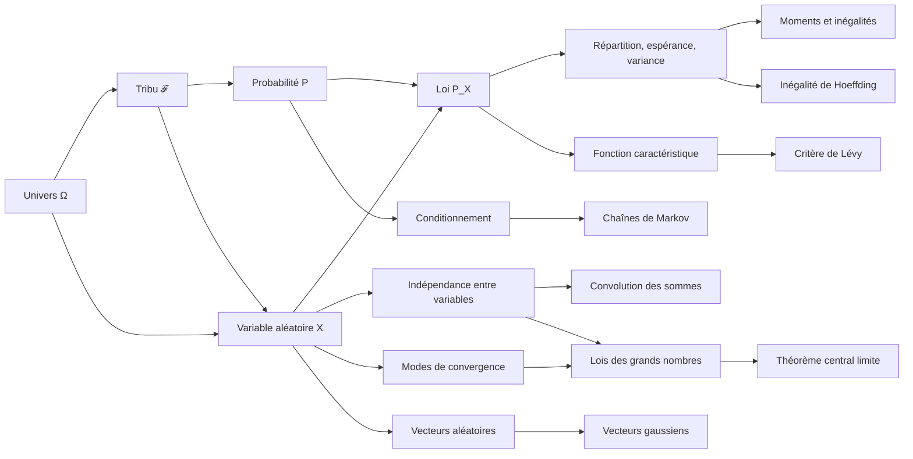

# Probabilités - Espaces probabilisés et variables aléatoires

> [!abstract] Objectif du cours
> Construire rigoureusement un modèle probabiliste, comprendre comment une variable aléatoire transforme ce modèle en une loi sur un espace plus concret, puis étudier la convergence, les théorèmes limites, la concentration, les vecteurs gaussiens, le conditionnement et les chaînes de Markov.

Sources manuscrites : [[cours-jour-1.pdf]], [[2026-09-15_suite-cours-probas.pdf]] et [[cours.pdf]].

## Vue d'ensemble

La chaîne logique est la suivante :

1. $\Omega$ décrit tous les résultats possibles d'une expérience.
2. $\mathcal F$ sélectionne les événements auxquels on sait attribuer une probabilité.
3. $\mathbb P$ attribue effectivement une probabilité à chacun de ces événements.
4. Une variable aléatoire $X$ transforme chaque issue $\omega\in\Omega$ en une valeur exploitable.
5. La loi $\mathbb P_X$ décrit la répartition des valeurs de $X$, sans avoir besoin de conserver le détail de $\Omega$.
6. Les différents modes de convergence précisent en quel sens une suite de variables aléatoires se rapproche d'une limite.
7. Les lois des grands nombres, le théorème central limite et les inégalités de concentration décrivent les sommes de variables indépendantes à grande échelle et à taille finie.
8. Les vecteurs aléatoires étendent espérance, covariance et lois gaussiennes à plusieurs dimensions.
9. Le conditionnement met à jour une loi à partir d'une information, tandis que les chaînes de Markov modélisent une évolution dont le futur ne dépend du passé qu'à travers l'état présent.

---

# I. Espaces probabilisés

## 1. Univers et événements

> [!definition] Univers
> L'**univers**, noté $\Omega$, est l'ensemble de toutes les issues possibles de l'expérience aléatoire.

Exemples :

- lancer d'une pièce : $\Omega=\{\mathrm{Pile},\mathrm{Face}\}$ ;
- lancer d'un dé : $\Omega=\{1,2,3,4,5,6\}$ ;
- durée de vie d'un composant : $\Omega=\mathbb R_+$.

Un **événement** est un sous-ensemble de $\Omega$. Il est réalisé lorsque l'issue observée appartient à ce sous-ensemble.

Exemple pour un dé :

$$
A=\{2,4,6\}
$$

est l'événement « obtenir un nombre pair ».

## 2. Tribu ou $\sigma$-algèbre

On ne demande pas toujours à tous les sous-ensembles de $\Omega$ d'être mesurables. On choisit une famille d'événements compatible avec les opérations logiques usuelles.

> [!definition] Tribu
> Une famille $\mathcal F\subseteq\mathcal P(\Omega)$ est une **tribu** ou **$\sigma$-algèbre** sur $\Omega$ si :
>
> 1. $\Omega\in\mathcal F$ ;
> 2. si $A\in\mathcal F$, alors $A^c=\Omega\setminus A\in\mathcal F$ ;
> 3. si $(A_n)_{n\in\mathbb N}$ est une suite d'éléments de $\mathcal F$, alors
>    $$
>    \bigcup_{n\in\mathbb N}A_n\in\mathcal F.
>    $$

### Décomposition des trois axiomes

- $\Omega\in\mathcal F$ : l'événement certain doit être mesurable.
- Stabilité par complémentaire : si l'on peut parler de « $A$ se produit », on doit pouvoir parler de « $A$ ne se produit pas ».
- Stabilité par union dénombrable : on peut agréger une suite d'événements mesurables.

> [!intuition]
> Une tribu est un langage d'événements. Elle contient exactement les questions oui/non auxquelles le modèle probabiliste accepte de répondre.

### Propriétés déduites

Les axiomes impliquent immédiatement :

$$
\varnothing=\Omega^c\in\mathcal F.
$$

Grâce aux lois de De Morgan, $\mathcal F$ est aussi stable par intersection dénombrable :

$$
\bigcap_{n\in\mathbb N}A_n
=\left(\bigcup_{n\in\mathbb N}A_n^c\right)^c
\in\mathcal F.
$$

→ [[preuve-lois-de-de-morgan|Détail de la démonstration avec les lois de De Morgan]]

Elle est donc également stable par unions et intersections finies, ainsi que par différence :

$$
A\setminus B=A\cap B^c\in\mathcal F.
$$

### Exemples de tribus

Sur un univers quelconque $\Omega$ :

- la tribu triviale $\{\varnothing,\Omega\}$ ;
- la tribu maximale $\mathcal P(\Omega)$ ;
- pour $A\subseteq\Omega$, la tribu $\{\varnothing,A,A^c,\Omega\}$.

## 3. Mesure de probabilité

> [!definition] Probabilité
> Sur un espace mesurable $(\Omega,\mathcal F)$, une **mesure de probabilité** est une application
> $$
> \mathbb P:\mathcal F\longrightarrow[0,1]
> $$
> telle que :
>
> 1. $\mathbb P(\Omega)=1$ ;
> 2. pour toute suite $(A_n)_{n\in\mathbb N}$ d'événements deux à deux disjoints,
>    $$
>    \mathbb P\!\left(\bigcup_{n\in\mathbb N}A_n\right)
>    =\sum_{n\in\mathbb N}\mathbb P(A_n).
>    $$

Le triplet

$$
(\Omega,\mathcal F,\mathbb P)
$$

est appelé **espace probabilisé**.

> [!example] Modèle uniforme fini
> Si $\Omega$ est fini et si toutes les issues sont équiprobables, alors $\mathcal F=\mathcal P(\Omega)$ et
> $$
> \mathbb P(A)=\frac{|A|}{|\Omega|}.
> $$
> Pour un dé équilibré, la probabilité d'obtenir un nombre pair vaut $3/6=1/2$.

## 4. Calcul élémentaire sur les événements

### Complémentaire

Comme $A$ et $A^c$ sont disjoints et que $A\cup A^c=\Omega$,

$$
\boxed{\mathbb P(A^c)=1-\mathbb P(A)}.
$$

### Différence et monotonie

Si $A\subseteq B$, alors $B=A\sqcup(B\setminus A)$, donc

$$
\boxed{\mathbb P(B\setminus A)=\mathbb P(B)-\mathbb P(A)}.
$$

Puisque $\mathbb P(B\setminus A)\geq 0$, on obtient la **monotonie** :

$$
A\subseteq B\quad\Longrightarrow\quad\mathbb P(A)\leq\mathbb P(B).
$$

### Formule d'inclusion-exclusion à deux ensembles

Les ensembles $A$ et $B$ peuvent se recouvrir. Additionner $\mathbb P(A)$ et $\mathbb P(B)$ compte alors deux fois l'intersection. Ainsi,

$$
\boxed{\mathbb P(A\cup B)
=\mathbb P(A)+\mathbb P(B)-\mathbb P(A\cap B)}.
$$

### Inégalité de l'union

Pour une suite quelconque d'événements, non nécessairement disjoints,

$$
\boxed{\mathbb P\!\left(\bigcup_{n\in\mathbb N}A_n\right)
\leq\sum_{n\in\mathbb N}\mathbb P(A_n)}.
$$

Cette propriété est aussi appelée **sous-additivité dénombrable** ou **borne de l'union**.

## 5. Continuité des probabilités

### Suite croissante d'événements

On écrit $A_n\uparrow A$ lorsque

$$
A_0\subseteq A_1\subseteq\cdots
\qquad\text{et}\qquad
A=\bigcup_{n\in\mathbb N}A_n.
$$

Alors

$$
\boxed{\mathbb P(A)=\lim_{n\to\infty}\mathbb P(A_n)}.
$$

→ [[preuve-continuite-croissante|Preuve détaillée par couches disjointes et développement du passage à la limite]]

### Suite décroissante d'événements

On écrit $A_n\downarrow A$ lorsque

$$
A_0\supseteq A_1\supseteq\cdots
\qquad\text{et}\qquad
A=\bigcap_{n\in\mathbb N}A_n.
$$

Dans un espace probabilisé,

$$
\boxed{\mathbb P(A)=\lim_{n\to\infty}\mathbb P(A_n)}.
$$

→ [[preuve-continuite-decroissante|Preuve détaillée par complémentaires et développement du passage à la limite]]

> [!warning] Mesure générale
> Pour une mesure quelconque $\mu$, la continuité décroissante demande l'hypothèse $\mu(A_0)<\infty$. Elle est automatiquement satisfaite pour une probabilité puisque $\mathbb P(A_0)\leq1$.

## 6. Tribu engendrée

> [!definition] Tribu engendrée
> Pour une famille $\mathcal C\subseteq\mathcal P(\Omega)$, la tribu engendrée par $\mathcal C$ est
> $$
> \boxed{\sigma(\mathcal C)
> =\bigcap_{\substack{\mathcal G\text{ tribu sur }\Omega\\\mathcal C\subseteq\mathcal G}}\mathcal G}.
> $$

Autrement dit, $\sigma(\mathcal C)$ est la **plus petite tribu contenant $\mathcal C$**.

### Comment lire cette définition ?

1. On considère toutes les tribus qui contiennent $\mathcal C$.
2. On les intersecte.
3. L'intersection est encore une tribu.
4. Elle ne contient que les ensembles imposés par $\mathcal C$ et les opérations de tribu.

## 7. Tribu borélienne

> [!definition] Boréliens de $\mathbb R$
> La tribu borélienne de $\mathbb R$ est la tribu engendrée par les ouverts :
> $$
> \boxed{\mathcal B(\mathbb R)=\sigma\big(\{U\subseteq\mathbb R:U\text{ ouvert}\}\big)}.
> $$

Elle contient notamment tous les ouverts, fermés, intervalles et singletons, ainsi que toute combinaison dénombrable de ces ensembles.

On peut aussi l'engendrer à partir de familles plus petites, par exemple :

$$
\mathcal B(\mathbb R)
=\sigma\big(\{(-\infty,a]:a\in\mathbb R\}\big).
$$

> [!intuition]
> Sur un espace non dénombrable comme $\mathbb R$, la tribu borélienne fournit une collection suffisamment riche pour l'analyse tout en restant compatible avec la construction des mesures usuelles.

Pour $\mathbb R^d$,

$$
\mathcal B(\mathbb R^d)
=\underbrace{\mathcal B(\mathbb R)\otimes\cdots\otimes\mathcal B(\mathbb R)}_{d\text{ facteurs}}.
$$

## 8. Mesure de Lebesgue et densités

La mesure de Lebesgue $\lambda$ formalise la notion de longueur :

$$
\lambda((a,b])=b-a
\qquad(a<b).
$$

> [!definition] Densité de probabilité
> Une fonction mesurable $f:\mathbb R\to[0,+\infty)$ est une densité de probabilité si
> $$
> \int_{\mathbb R}f(x)\,\mathrm dx=1.
> $$
> Elle définit alors une probabilité par
> $$
> \boxed{\mathbb P(A)=\int_A f(x)\,\mathrm dx},
> \qquad A\in\mathcal B(\mathbb R).
> $$

Pour un intervalle,

$$
\mathbb P((a,b])=\int_a^b f(x)\,\mathrm dx.
$$

> [!warning]
> La valeur $f(x)$ n'est pas la probabilité du point $x$. Pour une loi à densité, $\mathbb P(X=x)=0$ pour tout $x$. Les probabilités s'obtiennent en intégrant $f$ sur des ensembles.

### Mesures produits

Si $\mu$ et $\nu$ sont des mesures sur deux espaces, leur mesure produit est caractérisée sur les rectangles mesurables par

$$
(\mu\otimes\nu)(A\times B)=\mu(A)\nu(B).
$$

Cette construction permet de définir les mesures et les lois sur $\mathbb R^d$.

## 9. Lois à densité usuelles

### Loi uniforme sur $[a,b]$

Pour $a<b$, $X\sim\mathcal U([a,b])$ si sa densité vaut

$$
f_X(x)=\frac{1}{b-a}\mathbf 1_{[a,b]}(x).
$$

La masse totale est bien égale à $1$ :

$$
\int_{\mathbb R}f_X(x)\,\mathrm dx
=\frac{1}{b-a}\int_a^b\mathrm dx=1.
$$

### Loi exponentielle

Pour $\lambda>0$, $X\sim\mathcal E(\lambda)$ si

$$
f_X(x)=\lambda e^{-\lambda x}\mathbf 1_{\mathbb R_+}(x).
$$

Le paramètre $\lambda$ est un taux : plus $\lambda$ est grand, plus la variable est concentrée près de $0$.

### Loi normale

Pour $\mu\in\mathbb R$ et $\sigma>0$, $X\sim\mathcal N(\mu,\sigma^2)$ si

$$
f_X(x)=\frac{1}{\sqrt{2\pi}\,\sigma}
\exp\!\left(-\frac{(x-\mu)^2}{2\sigma^2}\right).
$$

Ici, $\mu$ est l'espérance et $\sigma^2$ la variance.

---

# II. Variables aléatoires

## 10. Applications mesurables

Soient deux espaces mesurables $(E,\mathcal E)$ et $(F,\mathcal G)$.

> [!definition] Application mesurable
> Une application $f:E\to F$ est mesurable si
> $$
> \forall A\in\mathcal G,\qquad f^{-1}(A)\in\mathcal E.
> $$

L'image réciproque de $A$ est

$$
f^{-1}(A)=\{x\in E:f(x)\in A\}.
$$

> [!intuition]
> La mesurabilité garantit que toute question mesurable posée sur la valeur de sortie peut être traduite en un événement mesurable dans l'espace de départ.

## 11. Définition d'une variable aléatoire

> [!definition] Variable aléatoire
> Sur un espace probabilisé $(\Omega,\mathcal F,\mathbb P)$, une variable aléatoire à valeurs dans $(E,\mathcal E)$ est une application mesurable
> $$
> X:(\Omega,\mathcal F)\longrightarrow(E,\mathcal E).
> $$

Cela signifie que

$$
A\in\mathcal E
\quad\Longrightarrow\quad
X^{-1}(A)=\{\omega\in\Omega:X(\omega)\in A\}\in\mathcal F.
$$

Par conséquent, la quantité

$$
\mathbb P(X\in A)
=\mathbb P\big(X^{-1}(A)\big)
$$

est bien définie.

> [!warning]
> Une variable aléatoire n'est pas « aléatoire » en tant que fonction : une fois $\omega$ fixé, $X(\omega)$ est déterminé. L'aléa vient du fait que l'issue $\omega$ n'est pas connue.

## 12. Tribu engendrée par une variable aléatoire

> [!definition]
> La tribu engendrée par $X$ est
> $$
> \boxed{\sigma(X)=\sigma\big(\{X^{-1}(A):A\in\mathcal E\}\big)}.
> $$

Elle représente l'information observable lorsque l'on ne connaît que $X$.

> [!example]
> Si un dé est lancé et si $X$ vaut $0$ pour un résultat impair et $1$ pour un résultat pair, observer $X$ permet seulement de connaître la parité. La tribu $\sigma(X)$ ne distingue pas les issues $2$, $4$ et $6$ entre elles.

## 13. Loi d'une variable aléatoire

> [!definition] Loi image
> La loi de $X$ est la probabilité $\mathbb P_X$ définie sur $(E,\mathcal E)$ par
> $$
> \boxed{\mathbb P_X(A)
> =\mathbb P(X^{-1}(A))
> =\mathbb P(X\in A)}.
> $$

On dit que deux variables aléatoires $X$ et $Y$ ont la même loi, et on note

$$
X\overset{\mathcal L}=Y
\quad\text{ou}\quad
X\sim Y,
$$

si $\mathbb P_X=\mathbb P_Y$.

> [!important]
> Avoir la même loi ne signifie pas que $X=Y$ issue par issue. Les deux variables peuvent être définies sur des espaces probabilisés différents.

## 14. Fonction de répartition

Pour une variable aléatoire réelle $X$, la fonction de répartition est

$$
\boxed{F_X(x)=\mathbb P(X\leq x)
=\mathbb P_X(( -\infty,x])}.
$$

Elle possède quatre propriétés fondamentales :

1. $F_X$ est croissante ;
2. $F_X$ est continue à droite ;
3. $\displaystyle\lim_{x\to-\infty}F_X(x)=0$ ;
4. $\displaystyle\lim_{x\to+\infty}F_X(x)=1$.

Elle permet de retrouver les probabilités d'intervalles :

$$
\mathbb P(a<X\leq b)=F_X(b)-F_X(a).
$$

Si $X$ admet une densité $f_X$, alors

$$
F_X(x)=\int_{-\infty}^{x}f_X(t)\,\mathrm dt.
$$

Aux points où $F_X$ est dérivable,

$$
F_X'(x)=f_X(x).
$$

> [!theorem] Caractérisation de la loi
> La fonction de répartition détermine entièrement la loi d'une variable aléatoire réelle :
> $$
> \boxed{
> F_X=F_Y
> \quad\Longleftrightarrow\quad
> \mathbb P_X=\mathbb P_Y}.
> $$

## 15. Espérance

> [!definition] Espérance
> Lorsque $X$ est intégrable, c'est-à-dire lorsque $\mathbb E[|X|]<\infty$, son espérance est
> $$
> \boxed{\mathbb E[X]=\int_\Omega X(\omega)\,\mathrm d\mathbb P(\omega)}.
> $$

L'espérance est une moyenne pondérée par les probabilités.

### Cas discret

Si $X$ prend ses valeurs dans un ensemble fini ou dénombrable $S$,

$$
\boxed{\mathbb E[X]=\sum_{x\in S}x\,\mathbb P(X=x)}.
$$

Plus généralement,

$$
\mathbb E[g(X)]
=\sum_{x\in S}g(x)\,\mathbb P(X=x),
$$

dès que la série est absolument convergente.

### Cas à densité

Si $X$ admet une densité $f_X$,

$$
\boxed{\mathbb E[g(X)]
=\int_{\mathbb R}g(x)f_X(x)\,\mathrm dx},
$$

pour toute fonction mesurable $g$ telle que l'intégrale existe.

> [!note] Théorème de transfert
> Les formules précédentes sont des cas du théorème de transfert :
> $$
> \mathbb E[g(X)]=\int_E g(x)\,\mathrm d\mathbb P_X(x).
> $$
> Elles montrent que, pour calculer une espérance dépendant seulement de $X$, connaître sa loi suffit.

### Linéarité

Pour $a,b\in\mathbb R$,

$$
\boxed{\mathbb E[aX+b]=a\mathbb E[X]+b}.
$$

Plus généralement,

$$
\mathbb E[aX+bY]=a\mathbb E[X]+b\mathbb E[Y]
$$

lorsque les variables sont intégrables.

## 16. Variance

> [!definition] Variance
> Si $X$ est de carré intégrable, sa variance est
> $$
> \boxed{\operatorname{Var}(X)
> =\mathbb E\!\left[(X-\mathbb E[X])^2\right]}.
> $$

En développant le carré,

$$
\boxed{\operatorname{Var}(X)
=\mathbb E[X^2]-\mathbb E[X]^2}.
$$

La variance mesure la dispersion quadratique autour de l'espérance.

Pour $a,b\in\mathbb R$,

$$
\boxed{\operatorname{Var}(aX+b)=a^2\operatorname{Var}(X)}.
$$

La translation par $b$ ne change pas la dispersion ; la multiplication par $a$ multiplie les écarts par $|a|$, donc les écarts au carré par $a^2$.

## 17. Covariance

> [!definition] Covariance
> Pour deux variables $X$ et $Y$ de carré intégrable,
> $$
> \boxed{\operatorname{Cov}(X,Y)
> =\mathbb E\!\left[(X-\mathbb E[X])(Y-\mathbb E[Y])\right]}.
> $$

En développant,

$$
\boxed{\operatorname{Cov}(X,Y)
=\mathbb E[XY]-\mathbb E[X]\mathbb E[Y]}.
$$

La covariance est symétrique et bilinéaire. En particulier,

$$
\operatorname{Cov}(X,Y)=\operatorname{Cov}(Y,X).
$$

La variance d'une somme s'écrit

$$
\boxed{\operatorname{Var}(X+Y)
=\operatorname{Var}(X)+\operatorname{Var}(Y)
+2\operatorname{Cov}(X,Y)}.
$$

Si $\operatorname{Cov}(X,Y)=0$, alors $X$ et $Y$ sont dites **non corrélées** et

$$
\operatorname{Var}(X+Y)
=\operatorname{Var}(X)+\operatorname{Var}(Y).
$$

> [!warning] Indépendance et covariance
> L'indépendance implique une covariance nulle lorsque les moments existent. La réciproque est fausse en général : deux variables peuvent être non corrélées sans être indépendantes.

---

# III. Intégrabilité, inégalités et indépendance

## 18. Espaces $L^p$

> [!summary] Carte détaillée
> Cette section a été développée dans [[approfondissement-espaces-lp|Espaces $L^p$ - carte détaillée]].
>
> Idée essentielle : $X\in L^p$ signifie que les grandes valeurs de $X$ sont suffisamment rares pour que $\mathbb E[|X|^p]$ soit finie. Plus $p$ est grand, plus la condition contrôle sévèrement les grandes valeurs.

## 19. Inégalités fondamentales

### Inégalité de Markov

> [!theorem] Markov
> Si $X\in L^1$, alors, pour tout $a>0$,
> $$
> \boxed{\mathbb P(|X|\geq a)
> \leq\frac{\mathbb E[|X|]}{a}}.
> $$

Cette inégalité transforme une information moyenne sur $|X|$ en un contrôle de la probabilité que $X$ prenne une grande valeur.

> [!proof]- Preuve
> Point par point,
> $$
> |X|\geq a\,\mathbf 1_{\{|X|\geq a\}}.
> $$
> En prenant l'espérance,
> $$
> \mathbb E[|X|]
> \geq a\,\mathbb E\!\left[\mathbf 1_{\{|X|\geq a\}}\right]
> =a\,\mathbb P(|X|\geq a).
> $$
> Il suffit ensuite de diviser par $a>0$.

### Inégalité de Bienaymé-Tchebychev

> [!theorem] Bienaymé-Tchebychev
> Si $X\in L^2$, alors, pour tout $a>0$,
> $$
> \boxed{\mathbb P\big(|X-\mathbb E[X]|\geq a\big)
> \leq\frac{\operatorname{Var}(X)}{a^2}}.
> $$

> [!proof]- Déduction à partir de Markov
> Appliquons Markov à la variable positive
> $$
> Y=(X-\mathbb E[X])^2
> $$
> avec le seuil $a^2$ :
> $$
> \begin{aligned}
> \mathbb P\big(|X-\mathbb E[X]|\geq a\big)
> &=\mathbb P(Y\geq a^2)\\
> &\leq\frac{\mathbb E[Y]}{a^2}\\
> &=\frac{\operatorname{Var}(X)}{a^2}.
> \end{aligned}
> $$

Une conséquence importante est

$$
\boxed{\operatorname{Var}(X)=0
\quad\Longrightarrow\quad
X=\mathbb E[X]\quad\text{presque sûrement}.}
$$

En effet, Tchebychev donne une probabilité nulle à tout écart strictement positif par rapport à $\mathbb E[X]$.

### Inégalité de Cauchy-Schwarz

> [!theorem] Cauchy-Schwarz
> Si $X,Y\in L^2$, alors
> $$
> \boxed{|\mathbb E[XY]|
> \leq\sqrt{\mathbb E[X^2]\,\mathbb E[Y^2]}}.
> $$

Cette inégalité garantit notamment que $XY\in L^1$ lorsque $X,Y\in L^2$.

> [!proof]- Preuve détaillée : un polynôme toujours positif
> Le point de départ est qu'un carré est toujours positif. Ainsi, pour tout $t\in\mathbb R$,
> $$
> (X-tY)^2\geq0,
> $$
> puis, en prenant l'espérance,
> $$
> \mathbb E[(X-tY)^2]\geq0.
> $$
>
> Développons le carré et utilisons la linéarité de l'espérance :
> $$
> \begin{aligned}
> \mathbb E[(X-tY)^2]
> &=\mathbb E[X^2-2tXY+t^2Y^2]\\
> &=\mathbb E[X^2]-2t\,\mathbb E[XY]+t^2\mathbb E[Y^2].
> \end{aligned}
> $$
>
> Posons donc
> $$
> q(t)=\mathbb E[Y^2]t^2-2\mathbb E[XY]t+\mathbb E[X^2].
> $$
> Commençons par le cas $\mathbb E[Y^2]=0$. Comme $Y^2\geq0$, cela entraîne $Y=0$ presque sûrement ; donc $\mathbb E[XY]=0$ et l'inégalité est immédiate.
>
> Dans le cas restant, $\mathbb E[Y^2]>0$. Alors $q$ est bien un polynôme du second degré, positif ou nul pour **tout** réel $t$. Un tel polynôme ne peut pas avoir deux racines réelles distinctes ; son discriminant doit donc vérifier $\Delta\leq0$.
>
> Or,
> $$
> \begin{aligned}
> \Delta
> &=\bigl(-2\mathbb E[XY]\bigr)^2
> -4\mathbb E[Y^2]\mathbb E[X^2]\\
> &=4\mathbb E[XY]^2
> -4\mathbb E[X^2]\mathbb E[Y^2].
> \end{aligned}
> $$
> Ainsi, $\Delta\leq0$ implique
> $$
> \mathbb E[XY]^2
> \leq\mathbb E[X^2]\mathbb E[Y^2].
> $$
> Prendre la racine carrée des deux membres donne finalement
> $$
> \left|\mathbb E[XY]\right|
> \leq\sqrt{\mathbb E[X^2]\\,\mathbb E[Y^2]}.
> $$

> [!intuition]
> Le terme $\mathbb E[XY]$ mesure à quel point $X$ et $Y$ évoluent ensemble. La preuve dit qu'il ne peut pas être plus grand, en valeur absolue, que ce que permettent leurs « tailles quadratiques » $\sqrt{\mathbb E[X^2]}$ et $\sqrt{\mathbb E[Y^2]}$.

### Inégalité de Jensen

> [!theorem] Jensen
> Soit $\varphi:I\to\mathbb R$ une fonction convexe sur un intervalle $I$. Si $X$ est intégrable, à valeurs dans $I$, et si $\varphi(X)$ est intégrable, alors
> $$
> \boxed{\varphi(\mathbb E[X])\leq\mathbb E[\varphi(X)]}.
> $$

> [!intuition]
> Pour une fonction convexe, appliquer la fonction après avoir moyenné donne une valeur inférieure ou égale à la moyenne des valeurs transformées.

Avec $\varphi(x)=x^2$, Jensen donne

$$
\mathbb E[X]^2\leq\mathbb E[X^2],
$$

ce qui équivaut à $\operatorname{Var}(X)\geq0$.

> [!warning] Hypothèses d'intégrabilité
> La convexité de $\varphi$ ne suffit pas, à elle seule, à garantir que $\varphi(X)\in L^1$ ou $L^2$. L'intégrabilité de la quantité apparaissant à droite de Jensen doit être vérifiée.

## 20. Indépendance

### Indépendance de deux événements

> [!definition]
> Deux événements $A,B\in\mathcal F$ sont indépendants si
> $$
> \boxed{\mathbb P(A\cap B)=\mathbb P(A)\mathbb P(B)}.
> $$

Cela signifie que savoir si $A$ s'est produit ne modifie pas la probabilité de $B$, lorsque les probabilités conditionnelles sont définies.

### Indépendance de deux variables aléatoires

> [!definition]
> Deux variables aléatoires réelles $X$ et $Y$ sont indépendantes si, pour tous $A,B\in\mathcal B(\mathbb R)$,
> $$
> \boxed{\mathbb P(X\in A,\,Y\in B)
> =\mathbb P(X\in A)\mathbb P(Y\in B)}.
> $$

De façon équivalente, les tribus $\sigma(X)$ et $\sigma(Y)$ sont indépendantes.

### Indépendance d'une famille finie

Les variables $X_1,\ldots,X_m$ sont indépendantes si, pour tous boréliens $A_1,\ldots,A_m$,

$$
\boxed{
\mathbb P\!\left(\bigcap_{i=1}^m\{X_i\in A_i\}\right)
=\prod_{i=1}^m\mathbb P(X_i\in A_i)}.
$$

> [!warning] Indépendance mutuelle ou deux à deux
> L'indépendance mutuelle est plus forte que l'indépendance deux à deux. Vérifier que chaque paire $(X_i,X_j)$ est indépendante ne suffit pas, en général, à rendre toute la famille indépendante.

### Factorisation de la densité jointe

Si $X_1,\ldots,X_m$ sont indépendantes et possèdent des densités marginales $f_1,\ldots,f_m$, alors leur vecteur possède la densité jointe

$$
\boxed{f_{X_1,\ldots,X_m}(x_1,\ldots,x_m)
=\prod_{i=1}^m f_i(x_i)}.
$$

### Factorisation des espérances

Si $X$ et $Y$ sont indépendantes et si les quantités considérées sont intégrables, alors

$$
\mathbb E[g(X)h(Y)]
=\mathbb E[g(X)]\,\mathbb E[h(Y)].
$$

En particulier,

$$
\boxed{\mathbb E[XY]=\mathbb E[X]\mathbb E[Y]}
$$

et donc

$$
\boxed{\operatorname{Cov}(X,Y)=0}.
$$

La réciproque est fausse en général : une covariance nulle ne suffit pas à établir l'indépendance.

### Loi d'une somme et convolution

Si $X$ et $Y$ sont indépendantes, la loi de leur somme est la convolution de leurs lois :

$$
\boxed{\mathbb P_{X+Y}=\mathbb P_X*\mathbb P_Y}.
$$

Pour un borélien $A$,

$$
(\mathbb P_X*\mathbb P_Y)(A)
=\int_{\mathbb R}\mathbb P_X(A-y)\,\mathrm d\mathbb P_Y(y),
$$

où $A-y=\{x\in\mathbb R:x+y\in A\}$.

Si $X$ et $Y$ possèdent des densités $f_X$ et $f_Y$, alors

$$
\boxed{f_{X+Y}(z)
=(f_X*f_Y)(z)
=\int_{\mathbb R}f_X(z-y)f_Y(y)\,\mathrm dy}.
$$

---

# IV. Fonctions caractéristiques

## 21. Définition

> [!definition] Fonction caractéristique réelle
> Pour une variable aléatoire réelle $X$, sa fonction caractéristique est
> $$
> \boxed{\varphi_X(t)=\mathbb E[e^{itX}]},
> \qquad t\in\mathbb R.
> $$

Cette espérance existe toujours puisque

$$
|e^{itX}|=1.
$$

La fonction caractéristique est la transformée de Fourier de la loi de $X$ :

$$
\varphi_X(t)=\int_{\mathbb R}e^{itx}\,\mathrm d\mathbb P_X(x).
$$

### Cas vectoriel

Si $X$ est à valeurs dans $\mathbb R^d$, alors, pour $t\in\mathbb R^d$,

$$
\boxed{\varphi_X(t)
=\mathbb E\!\left[e^{i\langle t,X\rangle}\right]}.
$$

Ici, $\langle t,X\rangle$ désigne le produit scalaire euclidien.

## 22. Propriétés des fonctions caractéristiques

### Propriétés immédiates

Pour toute variable aléatoire $X$,

$$
\varphi_X(0)=1,
\qquad
|\varphi_X(t)|\leq1,
\qquad
\varphi_X(-t)=\overline{\varphi_X(t)}.
$$

La fonction $\varphi_X$ est également uniformément continue.

### Caractérisation de la loi

> [!theorem] Unicité
> La fonction caractéristique détermine entièrement la loi :
> $$
> \boxed{\varphi_X=\varphi_Y
> \quad\Longleftrightarrow\quad
> \mathbb P_X=\mathbb P_Y}.
> $$

Ainsi, pour démontrer que deux variables ont la même loi, il suffit de montrer que leurs fonctions caractéristiques coïncident.

### Somme de variables indépendantes

Si $X$ et $Y$ sont indépendantes,

$$
\boxed{\varphi_{X+Y}(t)=\varphi_X(t)\varphi_Y(t)}.
$$

> [!proof]- Preuve
> On utilise $e^{it(X+Y)}=e^{itX}e^{itY}$ puis la factorisation des espérances de fonctions de variables indépendantes :
> $$
> \begin{aligned}
> \varphi_{X+Y}(t)
> &=\mathbb E[e^{itX}e^{itY}]\\
> &=\mathbb E[e^{itX}]\,\mathbb E[e^{itY}]\\
> &=\varphi_X(t)\varphi_Y(t).
> \end{aligned}
> $$

Pour des variables indépendantes $X_1,\ldots,X_m$,

$$
\varphi_{X_1+\cdots+X_m}(t)
=\prod_{j=1}^m\varphi_{X_j}(t).
$$

### Fonction caractéristique d'une loi normale

Si $X\sim\mathcal N(\mu,\sigma^2)$, alors

$$
\boxed{\varphi_X(t)
=\exp\!\left(i\mu t-\frac{\sigma^2t^2}{2}\right)}.
$$

### Transformation affine

> [!note]
> Pour obtenir la densité de $aX+b$ (et non seulement sa fonction caractéristique), voir [[changement-de-variable#5. Cas affine : un raccourci utile|la formule de changement de variable]].

Pour $X$ à valeurs dans $\mathbb R^d$, $a\in\mathbb R$ et $b\in\mathbb R^d$,

$$
\boxed{\varphi_{aX+b}(t)
=e^{i\langle t,b\rangle}\varphi_X(at)}.
$$

En dimension $1$, cela devient

$$
\varphi_{aX+b}(t)=e^{itb}\varphi_X(at).
$$

> [!intuition]
> La convolution des lois devient un produit de fonctions caractéristiques. C'est ce qui rend ces fonctions particulièrement efficaces pour étudier les sommes de variables indépendantes.

---

# V. Convergence des variables aléatoires

Soient $(X_n)_{n\geq1}$ une suite de variables aléatoires réelles et $X$ une variable aléatoire réelle, définies sur un même espace probabilisé lorsque le mode de convergence l'exige.

## 23. Convergence presque sûre

> [!definition] Convergence presque sûre
> La suite $(X_n)$ converge **presque sûrement** vers $X$ si
> $$
> \boxed{
> \mathbb P\!\left(\left\{\omega\in\Omega:
> X_n(\omega)\longrightarrow X(\omega)\right\}\right)=1}.
> $$
> On note
> $$
> X_n\xrightarrow[n\to\infty]{\mathrm{p.s.}}X
> \qquad\text{ou}\qquad
> X_n\xrightarrow[n\to\infty]{\mathrm{a.s.}}X.
> $$

Cette convergence est ponctuelle en $\omega$, sauf éventuellement sur un événement de probabilité nulle.

> [!intuition]
> Après avoir fixé presque toute trajectoire $\omega$, la suite numérique $X_n(\omega)$ finit par se comporter comme $X(\omega)$.

## 24. Convergence dans $L^p$

> [!definition] Convergence dans $L^p$
> Soit $p\geq1$. Si $X_n,X\in L^p$, on dit que $(X_n)$ converge vers $X$ dans $L^p$ lorsque
> $$
> \boxed{\mathbb E\!\left[|X_n-X|^p\right]\longrightarrow0}.
> $$
> On note
> $$
> X_n\xrightarrow[n\to\infty]{L^p}X.
> $$

De façon équivalente,

$$
\|X_n-X\|_p
=\mathbb E[|X_n-X|^p]^{1/p}
\longrightarrow0.
$$

La convergence dans $L^p$ mesure donc une erreur moyenne d'ordre $p$.

## 25. Convergence en probabilité

> [!definition] Convergence en probabilité
> La suite $(X_n)$ converge **en probabilité** vers $X$ si, pour tout $\varepsilon>0$,
> $$
> \boxed{
> \mathbb P(|X_n-X|>\varepsilon)
> \longrightarrow0}.
> $$
> On note
> $$
> X_n\xrightarrow[n\to\infty]{\mathbb P}X.
> $$

Ici, on ne demande pas que toutes les trajectoires convergent : on demande que la probabilité d'une erreur supérieure à un seuil fixé devienne négligeable.

## 26. Convergence en loi

> [!definition] Convergence en loi
> La suite $(X_n)$ converge **en loi** vers $X$ si, pour toute fonction continue bornée $f:\mathbb R\to\mathbb R$,
> $$
> \boxed{\mathbb E[f(X_n)]\longrightarrow\mathbb E[f(X)]}.
> $$
> On note
> $$
> X_n\xrightarrow[n\to\infty]{\mathcal L}X.
> $$

Ce mode de convergence ne dépend que des lois $\mathbb P_{X_n}$ et $\mathbb P_X$. Les variables n'ont donc pas besoin d'être définies sur le même espace probabilisé.

> [!warning] Convergence en loi
> La fonction test $f$ doit être **bornée et continue** dans cette définition. L'application identité $f(x)=x$ n'est pas bornée : la convergence en loi n'implique donc pas, à elle seule, la convergence des espérances.

## 27. Relations entre les modes de convergence

Les implications fondamentales sont

$$
\boxed{
X_n\xrightarrow{\mathrm{p.s.}}X
\quad\Longrightarrow\quad
X_n\xrightarrow{\mathbb P}X
\quad\Longrightarrow\quad
X_n\xrightarrow{\mathcal L}X}.
$$

De plus, pour $p\geq1$,

$$
\boxed{
X_n\xrightarrow{L^p}X
\quad\Longrightarrow\quad
X_n\xrightarrow{\mathbb P}X}.
$$

> [!proof]- Pourquoi la convergence dans $L^p$ implique la convergence en probabilité
> La convergence $X_n\xrightarrow{L^p}X$ signifie
> $$
> \mathbb E[|X_n-X|^p]\longrightarrow0.
> $$
> Fixons $\varepsilon>0$ et appliquons l'inégalité de Markov à la variable positive
> $$
> Y_n=|X_n-X|^p.
> $$
> Comme $|X_n-X|>\varepsilon$ équivaut à $Y_n>\varepsilon^p$, on obtient
> $$
> \mathbb P(|X_n-X|>\varepsilon)
> =\mathbb P(Y_n>\varepsilon^p)
> \leq
> \frac{\mathbb E[Y_n]}{\varepsilon^p}
> =\frac{\mathbb E[|X_n-X|^p]}{\varepsilon^p}.
> $$
>
> Le dénominateur $\varepsilon^p$ est une constante strictement positive et le numérateur tend vers $0$. Le majorant tend donc vers $0$, ce qui est exactement $X_n\xrightarrow{\mathbb P}X$.

Les réciproques sont fausses en général.

### Extraction d'une sous-suite

> [!theorem] Sous-suite convergeant presque sûrement
> Si $X_n\xrightarrow{\mathbb P}X$, il existe une sous-suite $(X_{n_k})_{k\geq1}$ telle que
> $$
> \boxed{X_{n_k}\xrightarrow[k\to\infty]{\mathrm{p.s.}}X}.
> $$

Plus précisément, toute sous-suite de $(X_n)$ possède elle-même une sous-suite qui converge presque sûrement vers $X$. Cette propriété caractérise la convergence en probabilité.

### Un contre-exemple entre convergence presque sûre et convergence dans $L^1$

Soit $U\sim\mathcal U([0,1])$ et

$$
X_n=n\,\mathbf 1_{\{U\leq1/n\}}.
$$

Pour presque tout $\omega$, on a $U(\omega)>0$, donc $U(\omega)>1/n$ à partir d'un certain rang. Ainsi,

$$
X_n\xrightarrow{\mathrm{p.s.}}0.
$$

En revanche,

$$
\mathbb E[|X_n|]
=n\,\mathbb P(U\leq1/n)
=1.
$$

Par conséquent, $X_n$ ne converge pas vers $0$ dans $L^1$.

> [!warning]
> La convergence presque sûre ne contrôle pas à elle seule les grandes valeurs prises sur des événements de petite probabilité. Il faut une hypothèse supplémentaire, par exemple une domination intégrable, pour obtenir une convergence dans $L^1$ via le théorème de convergence dominée.

### Stabilité par application continue

Si $f:\mathbb R\to\mathbb R$ est continue, alors

$$
X_n\xrightarrow{\mathrm{p.s.}}X
\quad\Longrightarrow\quad
f(X_n)\xrightarrow{\mathrm{p.s.}}f(X),
$$

et

$$
X_n\xrightarrow{\mathbb P}X
\quad\Longrightarrow\quad
f(X_n)\xrightarrow{\mathbb P}f(X).
$$

Le théorème de l'application continue donne aussi

$$
X_n\xrightarrow{\mathcal L}X
\quad\Longrightarrow\quad
f(X_n)\xrightarrow{\mathcal L}f(X).
$$

---

# VI. Critères de convergence en loi

## 28. Critère par les fonctions de répartition

> [!theorem] Critère de convergence des fonctions de répartition
> On a
> $$
> X_n\xrightarrow{\mathcal L}X
> $$
> si et seulement si, pour tout $x\in\mathbb R$ où $F_X$ est continue,
> $$
> \boxed{F_{X_n}(x)\longrightarrow F_X(x)}.
> $$

On ne demande pas la convergence aux points de discontinuité de $F_X$, qui correspondent aux atomes de la loi limite.

### Cas discret

Si les variables $X_n$ et $X$ sont à valeurs dans $\mathbb Z$, alors

$$
\boxed{
X_n\xrightarrow{\mathcal L}X
\quad\Longleftrightarrow\quad
\forall k\in\mathbb Z,
\ \mathbb P(X_n=k)\longrightarrow\mathbb P(X=k)}.
$$

Le même principe vaut sur un espace dénombrable muni de la topologie discrète.

## 29. Théorème de continuité de Lévy

> [!theorem] Théorème de Lévy
> La convergence en loi est équivalente à la convergence ponctuelle des fonctions caractéristiques :
> $$
> \boxed{
> X_n\xrightarrow{\mathcal L}X
> \quad\Longleftrightarrow\quad
> \forall t\in\mathbb R,
> \ \varphi_{X_n}(t)\longrightarrow\varphi_X(t)}.
> $$

La version générale du théorème affirme aussi que si $\varphi_{X_n}(t)$ converge ponctuellement vers une fonction $\varphi$ continue en $0$, alors $\varphi$ est la fonction caractéristique d'une loi limite et les lois de $X_n$ convergent vers cette loi.

> [!intuition]
> Ce résultat relie directement les fonctions caractéristiques à l'étude des limites. Il est particulièrement utile pour les sommes de variables indépendantes, puisque leur fonction caractéristique est un produit.

## 30. Lemme de Slutsky

> [!theorem] Lemme de Slutsky
> Si
> $$
> X_n\xrightarrow{\mathcal L}X
> \qquad\text{et}\qquad
> Y_n\xrightarrow{\mathbb P}c,
> $$
> où $c\in\mathbb R$ est constant, alors
> $$
> \boxed{(X_n,Y_n)\xrightarrow{\mathcal L}(X,c)}.
> $$

En combinant ce résultat avec le théorème de l'application continue, on obtient notamment

$$
X_n+Y_n\xrightarrow{\mathcal L}X+c,
\qquad
X_nY_n\xrightarrow{\mathcal L}cX.
$$

Si $c\neq0$, alors également

$$
\frac{X_n}{Y_n}\xrightarrow{\mathcal L}\frac{X}{c}.
$$

---

# VII. Théorèmes limites pour des variables i.i.d.

Soient $X_1,X_2,\ldots$ des variables aléatoires indépendantes et identiquement distribuées, et posons

$$
S_n=\sum_{i=1}^nX_i,
\qquad
\overline X_n=\frac{S_n}{n}.
$$

## 31. Loi des grands nombres dans $L^2$

> [!theorem] Loi des grands nombres dans $L^2$
> Si $X_1\in L^2$ et $\mu=\mathbb E[X_1]$, alors
> $$
> \boxed{\frac{S_n}{n}\xrightarrow{L^2}\mu}.
> $$
> En particulier, $S_n/n\xrightarrow{\mathbb P}\mu$.

> [!proof]- Preuve
> Posons $\sigma^2=\operatorname{Var}(X_1)$. Par linéarité de l'espérance et indépendance,
> $$
> \mathbb E[S_n]=n\mu,
> \qquad
> \operatorname{Var}(S_n)=n\sigma^2.
> $$
> Par conséquent,
> $$
> \begin{aligned}
> \mathbb E\!\left[\left|\frac{S_n}{n}-\mu\right|^2\right]
> &=\operatorname{Var}\!\left(\frac{S_n}{n}\right)\\
> &=\frac{1}{n^2}\operatorname{Var}(S_n)\\
> &=\frac{\sigma^2}{n}
> \longrightarrow0.
> \end{aligned}
> $$

La moyenne empirique $\overline X_n$ estime donc de mieux en mieux la moyenne théorique $\mu$.

## 32. Loi forte des grands nombres

> [!theorem] Loi forte des grands nombres
> Si $X_1\in L^1$ et $\mu=\mathbb E[X_1]$, alors
> $$
> \boxed{\frac{S_n}{n}\xrightarrow{\mathrm{p.s.}}\mu}.
> $$

La loi forte demande seulement un moment d'ordre $1$ et fournit une conclusion plus forte que la convergence en probabilité.

> [!note] Loi faible et loi forte
> La **loi faible des grands nombres** désigne une convergence en probabilité de la moyenne empirique. La **loi forte** donne une convergence presque sûre. Sous l'hypothèse $L^2$, la preuve précédente établit même une convergence dans $L^2$.

## 33. Théorème central limite

> [!theorem] Théorème central limite
> Supposons $X_1\in L^2$, avec
> $$
> \mathbb E[X_1]=\mu,
> \qquad
> \operatorname{Var}(X_1)=\sigma^2>0.
> $$
> Alors
> $$
> \boxed{
> \frac{S_n-n\mu}{\sigma\sqrt n}
> =\frac{\sqrt n(\overline X_n-\mu)}{\sigma}
> \xrightarrow{\mathcal L}\mathcal N(0,1)}.
> $$

La loi des grands nombres décrit la position de $\overline X_n$, tandis que le théorème central limite décrit ses fluctuations, d'ordre $1/\sqrt n$, autour de $\mu$.

Pour $n$ grand, on obtient l'approximation

$$
\overline X_n
\approx
\mathcal N\!\left(\mu,\frac{\sigma^2}{n}\right).
$$

---

# VIII. Concentration à taille finie

Les théorèmes limites décrivent un comportement asymptotique. Une inégalité de concentration fournit, pour chaque taille $n$, une borne explicite sur la probabilité d'un écart.

## 34. Inégalité de Hoeffding

> [!theorem] Inégalité de Hoeffding
> Soient $X_1,\ldots,X_n$ des variables aléatoires i.i.d. telles que
> $$
> \mathbb E[X_i]=\mu
> \qquad\text{et}\qquad
> a\leq X_i\leq b\quad\text{p.s.}
> $$
> Alors, pour tout $\varepsilon>0$,
> $$
> \boxed{
> \mathbb P\!\left(\left|\frac{S_n}{n}-\mu\right|\geq\varepsilon\right)
> \leq
> 2\exp\!\left(-\frac{2n\varepsilon^2}{(b-a)^2}\right)}.
> $$

La probabilité d'une erreur fixée décroît donc exponentiellement avec $n$. À titre de comparaison, l'inégalité de Tchebychev ne donne sous une hypothèse de variance finie qu'une décroissance en $1/n$.

### Taille d'échantillon suffisante

Pour garantir

$$
\mathbb P\!\left(|\overline X_n-\mu|\geq\varepsilon\right)
\leq\delta,
$$

il suffit que

$$
\boxed{
n\geq
\frac{(b-a)^2}{2\varepsilon^2}
\log\!\left(\frac{2}{\delta}\right)}.
$$

> [!example] Moyenne de variables de Bernoulli
> Si $X_i\sim\operatorname{Bernoulli}(p)$, alors $a=0$, $b=1$ et $\mu=p$. L'inégalité devient
> $$
> \mathbb P(|\overline X_n-p|\geq\varepsilon)
> \leq2e^{-2n\varepsilon^2}.
> $$
> La fréquence empirique $\overline X_n$ est ainsi concentrée autour de la probabilité de succès $p$.

---

# IX. Vecteurs aléatoires

## 35. Définition, espérance et matrice de covariance

> [!definition] Vecteur aléatoire
> Un **vecteur aléatoire** de dimension $d$ est une variable aléatoire
> $$
> X=
> \begin{pmatrix}
> X_1\\
> \vdots\\
> X_d
> \end{pmatrix}
> : (\Omega,\mathcal F)\longrightarrow
> (\mathbb R^d,\mathcal B(\mathbb R^d)).
> $$

Lorsque ses composantes sont intégrables, son espérance est définie composante par composante :

$$
\boxed{
\mathbb E[X]
=
\begin{pmatrix}
\mathbb E[X_1]\\
\vdots\\
\mathbb E[X_d]
\end{pmatrix}}.
$$

Si les composantes sont de carré intégrable, la **matrice de covariance** de $X$ est

$$
\boxed{
\Sigma_X
=\mathbb E\!\left[
(X-\mathbb E[X])(X-\mathbb E[X])^\top
\right]}.
$$

Son coefficient d'indices $(i,j)$ vaut

$$
(\Sigma_X)_{ij}=\operatorname{Cov}(X_i,X_j).
$$

La matrice $\Sigma_X$ est symétrique et positive semi-définie. En effet, pour tout $u\in\mathbb R^d$,

$$
\boxed{
u^\top\Sigma_Xu
=\operatorname{Var}(u^\top X)
\geq0}.
$$

> [!intuition]
> Les termes diagonaux de $\Sigma_X$ sont les variances des composantes. Les termes hors diagonale mesurent leurs variations conjointes.

## 36. Transformations affines

Soient $A\in\mathbb R^{q\times d}$ et $b\in\mathbb R^q$. Pour $Y=AX+b$,

$$
\boxed{
\mathbb E[Y]=A\mathbb E[X]+b}
$$

et

$$
\boxed{
\Sigma_Y=A\Sigma_XA^\top}.
$$

La seconde identité vient de

$$
Y-\mathbb E[Y]=A(X-\mathbb E[X]).
$$

Le cas $q=1$ redonne, pour tout $u\in\mathbb R^d$,

$$
\operatorname{Var}(u^\top X)=u^\top\Sigma_Xu.
$$

## 37. Vecteurs gaussiens

> [!definition] Vecteur gaussien
> Un vecteur aléatoire $X\in\mathbb R^d$ est **gaussien** si toute combinaison linéaire de ses composantes est une variable gaussienne :
> $$
> \forall u\in\mathbb R^d,
> \qquad
> u^\top X\ \text{est une variable gaussienne réelle}.
> $$
> On autorise ici les gaussiennes dégénérées, de variance nulle.

Si

$$
m=\mathbb E[X]
\qquad\text{et}\qquad
\Sigma=\Sigma_X,
$$

alors

$$
u^\top X\sim
\mathcal N\!\left(u^\top m,\,u^\top\Sigma u\right)
$$

et l'on note

$$
X\sim\mathcal N(m,\Sigma).
$$

Sa fonction caractéristique est

$$
\boxed{
\varphi_X(t)
=\mathbb E[e^{i\langle t,X\rangle}]
=\exp\!\left(
i\,t^\top m-\frac12t^\top\Sigma t
\right)},
\qquad t\in\mathbb R^d.
$$

### Densité d'un vecteur gaussien non dégénéré

Si $\Sigma$ est inversible, donc définie positive, $X$ possède la densité

$$
\boxed{
f_X(x)
=\frac{1}{(2\pi)^{d/2}\det(\Sigma)^{1/2}}
\exp\!\left(
-\frac12(x-m)^\top\Sigma^{-1}(x-m)
\right)}.
$$

Si $\Sigma$ n'est pas inversible, la loi est concentrée sur un sous-espace affine et ne possède pas de densité par rapport à la mesure de Lebesgue sur $\mathbb R^d$.

### Indépendance des composantes gaussiennes

> [!theorem]
> Si $X=(X_1,\ldots,X_d)^\top$ est un vecteur gaussien, alors
> $$
> \boxed{
> X_1,\ldots,X_d\ \text{sont indépendantes}
> \quad\Longleftrightarrow\quad
> \Sigma_X\ \text{est diagonale}}.
> $$

> [!proof]- Idée de la preuve
> Si les composantes sont indépendantes, leurs covariances deux à deux sont nulles : $\Sigma_X$ est diagonale.
>
> Réciproquement, si $\Sigma_X=\operatorname{diag}(\sigma_1^2,\ldots,\sigma_d^2)$, alors
> $$
> \begin{aligned}
> \varphi_X(t)
> &=\exp\!\left(
> i\sum_{j=1}^dt_jm_j
> -\frac12\sum_{j=1}^dt_j^2\sigma_j^2
> \right)\\
> &=\prod_{j=1}^d
> \exp\!\left(it_jm_j-\frac12t_j^2\sigma_j^2\right)\\
> &=\prod_{j=1}^d\varphi_{X_j}(t_j).
> \end{aligned}
> $$
> La fonction caractéristique jointe se factorise, ce qui établit l'indépendance.

> [!warning]
> « Non corrélées implique indépendantes » est une propriété spéciale des composantes d'un **même vecteur gaussien**. Elle est fausse pour des variables quelconques.

---

# X. Conditionnement

## 38. Probabilité conditionnelle

> [!definition] Conditionnement par un événement
> Pour $A,B\in\mathcal F$ avec $\mathbb P(B)>0$, la probabilité de $A$ sachant $B$ est
> $$
> \boxed{
> \mathbb P(A\mid B)
> =\frac{\mathbb P(A\cap B)}{\mathbb P(B)}}.
> $$

À $B$ fixé, l'application

$$
\mathbb P_B:A\longmapsto\mathbb P(A\mid B)
$$

est une mesure de probabilité sur $(\Omega,\mathcal F)$. Pour une variable intégrable sous cette nouvelle probabilité, on peut donc définir

$$
\boxed{
\mathbb E[X\mid B]
=\int_\Omega X\,\mathrm d\mathbb P_B}.
$$

> [!intuition]
> Conditionner par $B$ revient à restreindre le modèle aux issues compatibles avec l'information « $B$ est réalisé », puis à renormaliser les probabilités.

## 39. Formule des probabilités totales et formule de Bayes

Soit $(A_1,\ldots,A_m)$ une partition de $\Omega$, c'est-à-dire

$$
\Omega=\bigsqcup_{i=1}^m A_i,
$$

avec $\mathbb P(A_i)>0$. Pour tout événement $B$,

$$
\boxed{
\mathbb P(B)
=\sum_{i=1}^m\mathbb P(B\mid A_i)\mathbb P(A_i)}.
$$

En effet, les événements $B\cap A_i$ sont deux à deux disjoints et leur union est $B$.

Lorsque $\mathbb P(B)>0$, la formule de Bayes donne

$$
\boxed{
\mathbb P(A_i\mid B)
=\frac{
\mathbb P(B\mid A_i)\mathbb P(A_i)
}{
\sum_{j=1}^m\mathbb P(B\mid A_j)\mathbb P(A_j)
}}.
$$

Elle échange le sens du conditionnement : une vraisemblance $\mathbb P(B\mid A_i)$ et une probabilité a priori $\mathbb P(A_i)$ permettent de calculer la probabilité a posteriori $\mathbb P(A_i\mid B)$.

## 40. Loi et espérance conditionnelles dans le cas fini

On suppose ici que $X$ est réelle, que $X$ et $Y$ sont à valeurs dans des ensembles finis et que $X$ est intégrable. Pour toute valeur $y$ telle que $\mathbb P(Y=y)>0$,

$$
\boxed{
\mathbb P(X\in A\mid Y=y)
=\frac{
\mathbb P(X\in A,\,Y=y)
}{
\mathbb P(Y=y)
}}.
$$

La loi conditionnelle de $X$ sachant $Y=y$ permet de définir

$$
\boxed{
\mathbb E[X\mid Y=y]
=\sum_x x\,\mathbb P(X=x\mid Y=y)}.
$$

Posons

$$
g(y)=\mathbb E[X\mid Y=y].
$$

Sur les valeurs $y$ telles que $\mathbb P(Y=y)=0$, on peut définir $g(y)$ arbitrairement : cela ne change pas la variable obtenue presque sûrement.

L'**espérance conditionnelle de $X$ sachant $Y$** est alors la variable aléatoire

$$
\boxed{
\mathbb E[X\mid Y]=g(Y)}.
$$

Elle ne dépend de l'issue $\omega$ qu'à travers la valeur observée $Y(\omega)$. Dans ce cadre fini, elle vérifie notamment la propriété de la tour :

$$
\boxed{
\mathbb E\!\left[\mathbb E[X\mid Y]\right]
=\mathbb E[X]}.
$$

> [!warning]
> La notation $\mathbb E[X\mid Y]$ désigne une variable aléatoire, tandis que $\mathbb E[X\mid Y=y]$ est un nombre associé à une valeur $y$.

---

# XI. Chaînes de Markov finies

Dans cette section, l'espace d'états $E$ est fini et les chaînes considérées sont homogènes dans le temps.

## 41. Propriété de Markov

> [!definition] Chaîne de Markov
> Une suite de variables aléatoires $(X_n)_{n\geq0}$ à valeurs dans $E$ est une **chaîne de Markov** si, pour tout $n\geq0$ et tous $x_0,\ldots,x_n,y\in E$ tels que l'événement conditionnant soit de probabilité strictement positive,
> $$
> \boxed{
> \mathbb P(
> X_{n+1}=y
> \mid
> X_0=x_0,\ldots,X_n=x_n
> )
> =
> \mathbb P(X_{n+1}=y\mid X_n=x_n)}.
> $$

> [!intuition]
> Une fois l'état présent connu, le passé n'apporte plus d'information supplémentaire sur l'état suivant.

L'homogénéité signifie que la probabilité de transition ne dépend pas de l'instant $n$.

## 42. Matrice de transition et lois à plusieurs pas

> [!definition] Matrice de transition
> La matrice de transition $Q$ est définie par
> $$
> \boxed{
> Q(x,y)=\mathbb P(X_{n+1}=y\mid X_n=x)},
> \qquad x,y\in E.
> $$
> Par homogénéité, le membre de droite ne dépend pas de $n$.

La matrice $Q$ est **stochastique par lignes** :

$$
Q(x,y)\geq0
\qquad\text{et}\qquad
\sum_{y\in E}Q(x,y)=1.
$$

Les puissances de $Q$ décrivent les transitions en plusieurs étapes : pour tout $n\geq1$,

$$
\boxed{
\mathbb P(X_n=y\mid X_0=x)=Q^n(x,y)}.
$$

Si la loi initiale est représentée par le vecteur ligne

$$
\mu_0=(\mathbb P(X_0=x))_{x\in E},
$$

alors la loi au temps $n$ est

$$
\boxed{
\mu_n=\mu_0Q^n}.
$$

## 43. Distribution stationnaire

> [!definition] Distribution stationnaire
> Une probabilité $\pi$ sur $E$, vue comme un vecteur ligne, est **stationnaire** si
> $$
> \boxed{\pi=\pi Q}.
> $$

Si $X_0\sim\pi$, alors

$$
\mu_n=\pi Q^n=\pi
$$

pour tout $n$ : la loi de la chaîne ne change pas avec le temps.

## 44. Irréductibilité, apériodicité et convergence

> [!definition] Irréductibilité
> Une chaîne est **irréductible** si tout état peut être atteint depuis n'importe quel autre état :
> $$
> \forall x,y\in E,
> \qquad
> \exists n\geq0
> \quad\text{tel que}\quad
> Q^n(x,y)>0.
> $$

Pour un état $x$, sa période est

$$
d(x)=\gcd\{n\geq1:Q^n(x,x)>0\}.
$$

> [!definition] Apériodicité
> Une chaîne irréductible est **apériodique** si $d(x)=1$ pour un état $x$, et donc pour tous les états.

> [!theorem] Convergence vers l'équilibre
> Une chaîne de Markov finie, irréductible et apériodique possède une unique distribution stationnaire $\pi$ et, pour tous $x,y\in E$,
> $$
> \boxed{
> Q^n(x,y)\longrightarrow\pi(y)}.
> $$
> De façon équivalente, quelle que soit la loi initiale $\mu_0$,
> $$
> \boxed{
> \mu_0Q^n\longrightarrow\pi}.
> $$

> [!note] Rôle des hypothèses
> Sur un espace fini, l'irréductibilité suffit à assurer l'existence et l'unicité de la distribution stationnaire. L'apériodicité est nécessaire ici pour obtenir la convergence de $Q^n(x,\cdot)$ sans oscillation périodique.

---

# Synthèse

| Objet                    |                        Notation | Rôle                                                  |
| ------------------------ | ------------------------------: | ----------------------------------------------------- |
| Univers                  |                        $\Omega$ | Ensemble des issues possibles                         |
| Tribu                    |                    $\mathcal F$ | Événements auxquels on peut attribuer une probabilité |
| Probabilité              |                     $\mathbb P$ | Mesure de masse totale $1$                            |
| Espace probabilisé       | $(\Omega,\mathcal F,\mathbb P)$ | Modèle probabiliste complet                           |
| Variable aléatoire       |                 $X:\Omega\to E$ | Transformation mesurable d'une issue en une valeur    |
| Tribu engendrée          |                     $\sigma(X)$ | Information contenue dans l'observation de $X$        |
| Loi de $X$               |                   $\mathbb P_X$ | Probabilité transportée sur l'espace des valeurs      |
| Fonction de répartition  |                           $F_X$ | Probabilité cumulée $\mathbb P(X\leq x)$              |
| Espérance                |                  $\mathbb E[X]$ | Valeur moyenne                                        |
| Variance                 |         $\operatorname{Var}(X)$ | Dispersion quadratique                                |
| Covariance               |       $\operatorname{Cov}(X,Y)$ | Variation linéaire conjointe                          |
| Espace d'intégrabilité   |                           $L^p$ | Contrôle du moment d'ordre $p$                        |
| Indépendance             |           $X\perp\!\!\!\perp Y$ | Factorisation des événements ou de la loi jointe      |
| Convolution              |       $\mathbb P_X*\mathbb P_Y$ | Loi de la somme de variables indépendantes            |
| Fonction caractéristique |                     $\varphi_X$ | Transformée de Fourier caractérisant la loi           |
| Convergence presque sûre |      $X_n\xrightarrow{\mathrm{p.s.}}X$ | Convergence trajectoire par trajectoire, hors ensemble négligeable |
| Convergence dans $L^p$   |              $X_n\xrightarrow{L^p}X$ | Convergence de l'erreur moyenne d'ordre $p$            |
| Convergence en probabilité | $X_n\xrightarrow{\mathbb P}X$ | Disparition de la probabilité d'une erreur fixée       |
| Convergence en loi       |      $X_n\xrightarrow{\mathcal L}X$ | Convergence des lois                                   |
| Moyenne empirique        |       $\overline X_n=S_n/n$ | Estimation de la moyenne théorique                     |
| Concentration            |                    Hoeffding | Borne non asymptotique des écarts de la moyenne        |
| Vecteur aléatoire        |              $X\in\mathbb R^d$ | Variable aléatoire multidimensionnelle                 |
| Matrice de covariance    |                  $\Sigma_X$ | Variances et covariances des composantes               |
| Vecteur gaussien         |       $\mathcal N(m,\Sigma)$ | Loi normale multidimensionnelle                        |
| Conditionnement          |          $\mathbb P(A\mid B)$ | Mise à jour d'une probabilité sachant une information  |
| Espérance conditionnelle |        $\mathbb E[X\mid Y]$ | Moyenne de $X$ en fonction de l'information donnée par $Y$ |
| Matrice de transition    |                         $Q$ | Dynamique en un pas d'une chaîne de Markov              |
| Distribution stationnaire |               $\pi=\pi Q$ | Loi invariante par la dynamique                         |

## Formulaire minimal

$$
\begin{aligned}
\mathbb P(A^c)&=1-\mathbb P(A),\\
\mathbb P(A\cup B)&=\mathbb P(A)+\mathbb P(B)-\mathbb P(A\cap B),\\
\mathbb P_X(A)&=\mathbb P(X\in A),\\
F_X(x)&=\mathbb P(X\leq x),\\
\mathbb E[X]&=\int X\,\mathrm d\mathbb P,\\
\operatorname{Var}(X)&=\mathbb E[X^2]-\mathbb E[X]^2,\\
\operatorname{Cov}(X,Y)&=\mathbb E[XY]-\mathbb E[X]\mathbb E[Y],\\
\operatorname{Var}(X+Y)&=\operatorname{Var}(X)+\operatorname{Var}(Y)+2\operatorname{Cov}(X,Y),\\
\mathbb P(|X|\geq a)&\leq\frac{\mathbb E[|X|]}{a},\\
\mathbb P(|X-\mathbb E[X]|\geq a)&\leq\frac{\operatorname{Var}(X)}{a^2},\\
|\mathbb E[XY]|&\leq\sqrt{\mathbb E[X^2]\mathbb E[Y^2]},\\
X\perp\!\!\!\perp Y&\Longrightarrow \mathbb E[XY]=\mathbb E[X]\mathbb E[Y],\\
\mathbb P_{X+Y}&=\mathbb P_X*\mathbb P_Y\quad\text{si }X\perp\!\!\!\perp Y,\\
\varphi_X(t)&=\mathbb E[e^{itX}],\\
\varphi_{X+Y}(t)&=\varphi_X(t)\varphi_Y(t)\quad\text{si }X\perp\!\!\!\perp Y,\\
X_n\xrightarrow{L^p}X&\Longrightarrow X_n\xrightarrow{\mathbb P}X,\\
X_n\xrightarrow{\mathrm{p.s.}}X&\Longrightarrow X_n\xrightarrow{\mathbb P}X
\Longrightarrow X_n\xrightarrow{\mathcal L}X,\\
X_n\xrightarrow{\mathcal L}X
&\Longleftrightarrow \varphi_{X_n}(t)\to\varphi_X(t)\quad\forall t\in\mathbb R,\\
\frac{S_n}{n}&\xrightarrow{L^2}\mu\quad\text{si }X_1\in L^2,\\
\frac{S_n}{n}&\xrightarrow{\mathrm{p.s.}}\mu\quad\text{si }X_1\in L^1,\\
\frac{S_n-n\mu}{\sigma\sqrt n}&\xrightarrow{\mathcal L}\mathcal N(0,1),\\
\mathbb P(|\overline X_n-\mu|\geq\varepsilon)
&\leq2\exp\!\left(-\frac{2n\varepsilon^2}{(b-a)^2}\right)
\quad\text{si }a\leq X_i\leq b,\\
\Sigma_X&=\mathbb E[(X-\mathbb E[X])(X-\mathbb E[X])^\top],\\
\Sigma_{AX+b}&=A\Sigma_XA^\top,\\
\varphi_{\mathcal N(m,\Sigma)}(t)
&=\exp\!\left(it^\top m-\tfrac12t^\top\Sigma t\right),\\
\mathbb P(A\mid B)&=\frac{\mathbb P(A\cap B)}{\mathbb P(B)},\\
\mathbb P(B)&=\sum_i\mathbb P(B\mid A_i)\mathbb P(A_i),\\
\mathbb P(A_i\mid B)
&=\frac{\mathbb P(B\mid A_i)\mathbb P(A_i)}{\mathbb P(B)},\\
Q^n(x,y)&=\mathbb P(X_n=y\mid X_0=x),\\
\mu_n&=\mu_0Q^n,\\
\pi&=\pi Q.
\end{aligned}
$$

## Questions de compréhension

1. Pourquoi impose-t-on la stabilité d'une tribu par complémentaire et par union dénombrable ?
2. Quelle différence y a-t-il entre un événement $A$ et sa probabilité $\mathbb P(A)$ ?
3. Pourquoi la mesurabilité de $X$ est-elle nécessaire pour écrire $\mathbb P(X\in A)$ ?
4. Quelle information perd-on en remplaçant $X$ par sa loi $\mathbb P_X$ ?
5. Pourquoi une densité $f_X(x)$ n'est-elle pas une probabilité ponctuelle ?
6. Dans quel cas la variance d'une somme est-elle la somme des variances ?
7. Pourquoi $L^q\subseteq L^p$ lorsque $q\geq p$ sur un espace probabilisé ?
8. Comment Tchebychev se déduit-elle de Markov ?
9. Quelle différence y a-t-il entre indépendance mutuelle et indépendance deux à deux ?
10. Pourquoi les fonctions caractéristiques simplifient-elles l'étude des sommes indépendantes ?
11. Quelles sont les implications toujours vraies entre convergence presque sûre, convergence dans $L^p$, convergence en probabilité et convergence en loi ?
12. Pourquoi l'exemple $X_n=n\mathbf 1_{\{U\leq1/n\}}$ converge-t-il presque sûrement mais pas dans $L^1$ ?
13. À quels points faut-il vérifier la convergence des fonctions de répartition pour conclure à la convergence en loi ?
14. Quelle différence d'information donnent la loi des grands nombres et le théorème central limite ?
15. Comment déduire de l'inégalité de Hoeffding une taille d'échantillon pour une précision et un niveau de confiance fixés ?
16. Pourquoi la matrice de covariance est-elle toujours symétrique et positive semi-définie ?
17. Comment l'espérance et la covariance se transforment-elles sous l'application affine $X\mapsto AX+b$ ?
18. Pourquoi une matrice de covariance diagonale implique-t-elle l'indépendance des composantes dans le cas gaussien, mais pas en général ?
19. Quand un vecteur gaussien possède-t-il une densité sur $\mathbb R^d$ ?
20. Comment la formule des probabilités totales intervient-elle dans le dénominateur de la formule de Bayes ?
21. Quelle différence y a-t-il entre $\mathbb E[X\mid Y=y]$ et $\mathbb E[X\mid Y]$ ?
22. Comment lire le coefficient $Q^n(x,y)$ d'une chaîne de Markov homogène ?
23. Quels rôles distincts jouent l'irréductibilité et l'apériodicité dans la convergence vers une distribution stationnaire ?

## Pièges classiques

- Confondre $\Omega$, qui contient des issues, et $\mathcal F$, qui contient des ensembles d'issues.
- Oublier que la $\sigma$-additivité s'applique directement aux événements deux à deux disjoints.
- Écrire $\mathbb P(X=x)=f_X(x)$ pour une variable continue.
- Croire que deux variables de même loi sont égales presque sûrement.
- Oublier les hypothèses d'intégrabilité dans les formules d'espérance, de variance et de covariance.
- Déduire l'indépendance de la seule nullité de la covariance.
- Utiliser l'inclusion $L^q\subseteq L^p$ sans vérifier que la mesure totale est finie.
- Appliquer Jensen sans vérifier l'intégrabilité de $\varphi(X)$.
- Confondre indépendance deux à deux et indépendance mutuelle.
- Factoriser une espérance ou une densité jointe sans hypothèse d'indépendance.
- Oublier le facteur de phase $e^{itb}$ dans la fonction caractéristique de $aX+b$.
- Inverser les implications entre les modes de convergence : les réciproques sont fausses en général.
- Déduire la convergence des espérances de la seule convergence en loi.
- Vérifier la convergence des fonctions de répartition aux points de discontinuité de la loi limite au lieu de se limiter à ses points de continuité.
- Confondre la conclusion de la loi des grands nombres, $S_n/n\to\mu$, avec celle du TCL, qui porte sur les fluctuations renormalisées par $\sqrt n$.
- Appliquer Hoeffding sans vérifier l'indépendance et la borne presque sûre $a\leq X_i\leq b$.
- Conclure qu'une covariance nulle implique l'indépendance sans disposer de l'hypothèse gaussienne jointe.
- Utiliser la densité gaussienne multidimensionnelle alors que la matrice de covariance est singulière.
- Conditionner par un événement de probabilité nulle avec la formule élémentaire $\mathbb P(A\mid B)=\mathbb P(A\cap B)/\mathbb P(B)$.
- Confondre la fonction $y\mapsto\mathbb E[X\mid Y=y]$ avec la variable aléatoire $\mathbb E[X\mid Y]$ obtenue en l'évaluant en $Y$.
- Oublier que la relation $\mu_n=\mu_0Q^n$ utilise des vecteurs de probabilité écrits en ligne.
- Oublier que l'irréductibilité seule ne garantit pas la convergence de $Q^n$ si la chaîne est périodique.
