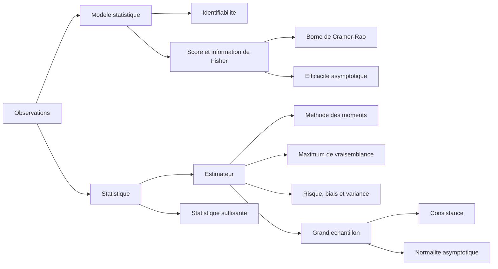

# Statistiques - modèles, estimation et précision

> [!abstract] Fil conducteur
> La statistique part d'un échantillon aléatoire $Z=(X_1,\ldots,X_n)$ et cherche à apprendre une quantité inconnue : un paramètre, une distribution, une probabilité, ou une règle de prédiction. Le cours répond à quatre questions : **que suppose-t-on sur les données ?**, **comment construire un estimateur ?**, **comment comparer sa précision ?**, puis **que devient-il lorsque $n$ grandit ?**

Cette note réorganise le support manuscrit autour des intuitions et d'un exemple fil rouge. Les formules servent à savoir quoi calculer et à interpréter le résultat, pas à remplacer l'idée derrière elles.

## La carte du cours

> [!tip] L'exemple fil rouge : des données oui/non
> Une campagne contient $n$ réponses indépendantes, codées $X_i=1$ pour « oui » et $X_i=0$ pour « non ». On suppose que chaque réponse vaut $1$ avec une probabilité inconnue $p$. Apprendre $p$ revient à apprendre la proportion réelle de « oui » dans la population. Cet exemple permettra de voir presque toutes les notions du cours sans les dissocier.

---

## 1. Du modèle aux données

### 1.1. Un modèle statistique est une famille d'explications possibles

Un modèle statistique contient une famille de lois de probabilité :

$$
\mathcal P=\{P_\theta : \theta\in\Theta\}.
$$

L'indice $\theta$ est le **paramètre inconnu**. Il représente ce qui varie d'une explication possible à l'autre. L'hypothèse centrale est qu'il existe une vraie valeur $\theta^\star$ telle que les observations ont été générées suivant $P_{\theta^\star}$.

La description complète fait intervenir un univers $\Omega$, une tribu $\mathcal F$, une variable aléatoire $Z$ et la famille de probabilités $P_\theta$. En pratique, on peut retenir l'image plus simple suivante : le modèle est une **boîte de lois candidates** ; les données doivent nous aider à choisir la bonne.

Très souvent,

$$
Z=(X_1,\ldots,X_n),
\qquad X_1,\ldots,X_n \text{ i.i.d. sous } P_\theta.
$$

« i.i.d. » signifie *indépendantes et de même loi*. C'est une hypothèse structurante : elle dit que chaque $X_i$ apporte une information nouvelle sur le même phénomène.

> [!warning] Un modèle n'est pas la réalité
> Dire que les $X_i$ sont i.i.d. est une hypothèse utile, pas une vérité automatique. Deux réponses d'une même personne, des mesures prises au fil du temps ou des observations voisines dans une image peuvent être dépendantes. Les estimateurs restent parfois utilisables, mais leurs garanties doivent alors être revues.

### 1.2. Paramétrique ou non paramétrique

Un modèle est **paramétrique** si $\Theta\subseteq\mathbb R^q$ pour un entier fini $q$. On résume alors l'inconnu par un nombre fini de coordonnées.

Exemples classiques :

- loi uniforme sur $[a,b]$, avec $\theta=(a,b)$ et $a<b$ ;
- loi gaussienne $\mathcal N(\mu,\sigma^2)$, avec $\theta=(\mu,\sigma^2)$ et $\sigma^2>0$ ;
- modèle de Bernoulli, avec $\theta=p\in[0,1]$.

Le modèle de Bernoulli de l'exemple fil rouge s'écrit

$$
P_p(X_i=1)=p,
\qquad P_p(X_i=0)=1-p.
$$

Dans un modèle **non paramétrique**, on ne force pas la loi à appartenir à une petite famille indexée par quelques nombres. Par exemple, on peut chercher directement une distribution $F$ ou une densité $f$, sans supposer a priori qu'elle est gaussienne. C'est plus souple, mais il faut plus de données pour apprendre un objet plus riche.

### 1.3. Identifiabilité : le paramètre doit avoir un sens observable

Le modèle est **identifiable** lorsque deux paramètres distincts donnent deux lois distinctes :

$$
P_\theta=P_{\theta'}
\quad\Longrightarrow\quad
\theta=\theta'.
$$

Sans cette propriété, même une infinité de données ne permettrait pas de distinguer certains paramètres : vouloir les estimer séparément n'aurait pas de sens.

> [!example] Un paramètre redondant
> Supposons que l'on paramètre une loi par $\theta\in\mathbb R$ mais que la loi ne dépende en réalité que de $\theta^2$. Les valeurs $\theta$ et $-\theta$ produisent exactement la même distribution. Le signe n'est donc pas identifiable ; on ne peut espérer apprendre que $|\theta|$ ou $\theta^2$.

### 1.4. Statistique, estimateur et décision

Une **statistique** est une quantité obtenue en appliquant une recette aux données $Z$. Formellement, c'est une fonction $T(Z)$. La recette ne doit pas demander de connaître la valeur inconnue de $\theta$ : elle doit pouvoir être exécutée dès que l'échantillon est observé.

Cela ne signifie pas que la statistique est un nombre fixe. **Avant** l'observation, $T(Z)$ est aléatoire car les données $Z$ le sont ; **après** l'observation, elle devient un nombre calculable. En revanche, $\theta$ lui-même n'est pas une statistique : c'est justement la quantité inaccessible que l'on cherche à apprendre.

La moyenne empirique est l'exemple fondamental :

$$
\overline X=\frac{1}{n}\sum_{i=1}^n X_i.
$$

Pour les réponses oui/non, $\overline X$ est tout simplement la proportion observée de « oui ». Elle ne contient aucun $p$ inconnu dans sa formule, donc c'est bien une statistique. Comme elle est aussi utilisée pour approcher $p$, on l'appelle plus précisément un **estimateur** de $p$.

D'autres statistiques résument les données autrement : $\max_i X_i$ garde seulement la plus grande valeur observée, la médiane garde un centre robuste aux valeurs extrêmes, et le nombre $\sum_i\mathbf 1_{\{X_i\ge 10\}}$ compte les observations au moins égales à $10$. Toutes sont calculables à partir de l'échantillon seul ; elles ne cherchent pas toutes à estimer le même objet.

Le mot **décision** est plus général. Une règle de décision est une fonction

$$
\delta:\mathcal Z\longrightarrow\mathcal D,
\qquad z\longmapsto\delta(z),
$$

qui transforme les données observées en une action. $\mathcal D$ est l'**espace des décisions** : il précise la forme de réponse autorisée. Une fois l'échantillon concret $z$ reçu, la règle $\delta$ renvoie une action déterminée $\delta(z)$.

- **Estimation.** Si le but est d'estimer $\theta$, on prend généralement $\mathcal D=\Theta$. La décision est alors $\widehat\theta=\delta(Z)$. Dans l'exemple Bernoulli, choisir $\delta(Z)=\overline X$ revient à décider que la meilleure estimation de $p$ est la proportion observée.

- **Classification binaire.** Pour un individu dont on connaît les caractéristiques $x$, l'action possible est une étiquette : $0$ ou $1$. On a donc $\mathcal D=\{0,1\}$. Par exemple, décider « non frauduleux » ou « frauduleux », ou « absent » ou « présent ». Si l'on apprend d'abord une règle pour classer de futurs individus, l'action construite à partir des données est une fonction $\widehat g_Z:\mathcal X\to\{0,1\}$ ; elle renverra ensuite une décision $\widehat g_Z(x)$ pour chaque nouveau $x$.

- **Prédiction ou régression.** La réponse n'est plus une étiquette, mais une valeur numérique ou plus généralement une sortie $\widehat y$. Pour prédire le prix d'un logement à partir de ses caractéristiques, la règle apprise est une fonction $f:\mathcal X\to\mathcal Y$, et la décision sur un logement $x$ est $f(x)$. Lorsque l'on doit prédire une seule valeur immédiatement, l'espace de décisions peut être directement $\mathcal D=\mathcal Y$ ; lorsque l'on apprend un prédicteur réutilisable, il est naturel de voir l'action comme la fonction $f$ elle-même.

> [!intuition]
> Une statistique est un **résumé calculé** à partir de l'échantillon. Une décision est ce que l'on **fait** de l'information disponible. Un estimateur est le cas particulier où la décision consiste à annoncer une valeur pour un paramètre inconnu. La distinction compte car la même statistique peut servir à plusieurs décisions : la moyenne peut estimer une espérance, déclencher une alerte si elle dépasse un seuil, ou devenir une variable d'entrée d'un classifieur.

---

## 2. Mesurer ce qu'est une bonne décision

### 2.1. Perte et risque

La **fonction de perte** $L(\theta,d)$ mesure le prix payé lorsque la vraie valeur est $\theta$ et que l'on prend la décision $d$. Comme les données sont aléatoires, la décision $\delta(Z)$ l'est aussi. On la juge donc en moyenne, via le **risque** :

$$
R(\theta,\delta)
=\mathbb E_\theta\bigl[L(\theta,\delta(Z))\bigr].
$$

Le risque est la quantité théorique que l'on aimerait minimiser. Il est théorique parce qu'il dépend de $\theta^\star$, précisément inconnue.

Pour l'estimation, la perte quadratique est la plus courante :

$$
L(\theta,\widehat\theta)
=\|\widehat\theta-\theta\|_2^2.
$$

Elle pénalise fortement les grandes erreurs. En dimension $1$, c'est simplement le carré de l'écart entre estimation et vérité.

> [!example] Une erreur de proportion
> Si la vraie proportion est $p=0{,}70$ et que l'on prédit $\widehat p=0{,}60$, la perte quadratique vaut $(0{,}60-0{,}70)^2=0{,}01$. Une erreur deux fois plus grande, égale à $0{,}20$, coûte quatre fois plus : $0{,}04$.

### 2.2. Lien avec l'apprentissage statistique

En prédiction, on observe des couples $(X,Y)$ et l'on cherche une fonction $f$ telle que $f(X)$ prédise bien $Y$. Son risque est

$$
\mathcal R(f)=\mathbb E\bigl[\ell(f(X),Y)\bigr].
$$

Avec la perte quadratique,

$$
\ell(f(X),Y)=\|f(X)-Y\|^2,
$$

la meilleure prédiction théorique est

$$
f^\star(x)=\mathbb E[Y\mid X=x].
$$

Cette formule ne dit pas que l'on connaît cette espérance conditionnelle : elle donne la cible idéale. L'apprentissage essaie de l'approcher avec les exemples disponibles.

Comme le vrai risque est inconnu, on calcule le **risque empirique** sur l'échantillon d'entraînement :

$$
\widehat{\mathcal R}_n(f)
=\frac{1}{n}\sum_{i=1}^n \ell\bigl(f(X_i),Y_i\bigr).
$$

> [!intuition]
> Le risque est la performance moyenne dans la population. Le risque empirique est la performance sur le petit échantillon que l'on a vu. Les confondre revient à croire qu'un élève qui a mémorisé ses exercices sait forcément résoudre un nouvel exercice.

---

## 3. Estimer sans imposer une famille de lois

Cette première famille de méthodes décrit directement ce que raconte l'échantillon. Elle sert en particulier lorsque l'on ne veut pas commencer par supposer une loi gaussienne, exponentielle ou autre.

### 3.1. Distribution empirique : chaque observation reçoit le même poids

La **distribution empirique** est

$$
\widehat P_n=\frac{1}{n}\sum_{i=1}^n\delta_{X_i},
$$

où $\delta_x$ désigne une masse de probabilité concentrée au point $x$. Pour tout ensemble $A$,

$$
\widehat P_n(A)
=\frac{1}{n}\sum_{i=1}^n\mathbf 1_{\{X_i\in A\}}.
$$

Autrement dit, elle donne à $A$ la fraction des observations qui sont tombées dans $A$.

Pour les données oui/non, $\widehat P_n(\{1\})=\overline X$. La proportion empirique est donc déjà une estimation non paramétrique de la probabilité d'un « oui ».

### 3.2. Moments empiriques

Le moment empirique d'ordre $k$ est la moyenne des puissances observées :

$$
\frac{1}{n}\sum_{i=1}^n X_i^k.
$$

Pour $k=1$, on retrouve la moyenne empirique. Pour $k=2$, on mesure une taille quadratique moyenne. Ces quantités imitent les moments théoriques $\mathbb E[X^k]$.

**Exemple — moyenne et dispersion.** Pour les données $2,3,3,4,8$, la moyenne vaut $4$. Elle résume le centre, mais cache la valeur isolée $8$. La variance empirique

$$
\frac{1}{n}\sum_{i=1}^n(X_i-\overline X)^2
$$

regarde au contraire la dispersion autour de ce centre.

### 3.3. Fonction de répartition empirique et histogramme

Quand les observations sont réelles, la **fonction de répartition empirique** est

$$
\widehat F_n(x)
=\frac{1}{n}\sum_{i=1}^n\mathbf 1_{\{X_i\le x\}}.
$$

Elle répond à la question : « quelle fraction des observations ne dépasse pas $x$ ? » C'est une fonction en escalier, qui monte de $1/n$ à chaque observation.

Le théorème de **Glivenko-Cantelli** affirme que, sous l'hypothèse i.i.d., cette courbe converge uniformément vers la vraie fonction de répartition $F$ :

$$
\sup_x\bigl|\widehat F_n(x)-F(x)\bigr|
\xrightarrow[n\to\infty]{\mathrm{p.s.}}0.
$$

Le message est fort : avec beaucoup de données indépendantes, l'escalier empirique est proche de la vraie courbe **partout à la fois**, pas seulement en un seuil $x$ fixé.

Un **histogramme** regroupe les valeurs dans des intervalles $[a_{j-1},a_j[$. Sa hauteur sur une classe est proportionnelle au nombre de données dans cette classe, divisé par la largeur de la classe :

$$
\widehat f_n(x)
=\sum_j
\frac{\widehat P_n([a_{j-1},a_j[)}{a_j-a_{j-1}}
\mathbf 1_{[a_{j-1},a_j[}(x).
$$

> [!tip] Lire un histogramme correctement
> Quand les classes n'ont pas la même largeur, il faut comparer les **aires** des rectangles, pas leurs hauteurs. Une barre haute et étroite peut représenter moins d'observations qu'une barre plus basse mais beaucoup plus large.

Le théorème de Donsker décrit plus finement les fluctuations : à l'échelle $\sqrt n$, l'écart $\widehat F_n-F$ converge vers un processus gaussien. Pour ce cours, il faut surtout retenir l'échelle : les fluctuations usuelles sont de l'ordre de $1/\sqrt n$.

---

## 4. Estimation paramétrique : deux recettes majeures

On suppose maintenant que les données suivent une loi $P_\theta$ d'une famille paramétrique. Le problème devient : comment choisir $\widehat\theta$ à partir de $X_1,\ldots,X_n$ ?

### 4.1. Méthode des moments : faire coïncider théorie et données

La méthode des moments remplace les moments théoriques par leurs versions empiriques. Si

$$
m_k(\theta)=\mathbb E_\theta[X^k],
$$

on choisit $\widehat\theta$ pour satisfaire, autant que possible,

$$
\frac{1}{n}\sum_{i=1}^n X_i^k
=m_k(\widehat\theta).
$$

Il faut en général autant d'équations que de paramètres inconnus.

**Exemple — une gaussienne inconnue.** Si $X_i\sim\mathcal N(\mu,\sigma^2)$, les deux premiers moments théoriques sont

$$
\mathbb E[X]=\mu,
\qquad
\mathbb E[X^2]=\mu^2+\sigma^2.
$$

En les égalant aux deux moments empiriques, on obtient

$$
\widehat\mu=\overline X,
\qquad
\widehat\sigma^2
=\frac{1}{n}\sum_{i=1}^n(X_i-\overline X)^2.
$$

L'idée est simple : une gaussienne avec les bons paramètres doit avoir le même centre et la même dispersion que les données.

La méthode des moments est souvent rapide et très intuitive. Elle n'utilise toutefois qu'une partie de l'information présente dans la forme complète de la distribution.

### 4.2. Vraisemblance : choisir le paramètre qui rend les données les plus plausibles

Lorsque $P_\theta$ possède une densité ou une masse $p_\theta$, la **vraisemblance** de l'échantillon observé $z=(x_1,\ldots,x_n)$ est la fonction

$$
L(z,\theta)=p_\theta(z).
$$

Pour des observations i.i.d., elle se factorise :

$$
L(z,\theta)=\prod_{i=1}^n p_\theta(x_i).
$$

Une fois $z$ observé, on ne considère pas ici une probabilité « sur $\theta$ ». On fixe les données et l'on regarde quels paramètres leur donnent une densité élevée. C'est le sens du mot *vraisemblance*.

L'**estimateur du maximum de vraisemblance** ou EMV/MLE est

$$
\widehat\theta_{\mathrm{MV}}
\in\operatorname*{arg\,max}_{\theta\in\Theta}L(z,\theta).
$$

On maximise presque toujours la log-vraisemblance, car le logarithme est croissant et transforme le produit en somme :

$$
\ell(z,\theta)
=\log L(z,\theta)
=\sum_{i=1}^n\log p_\theta(x_i).
$$

**Exemple — retrouver la proportion empirique par maximum de vraisemblance.** Pour $X_i\sim\mathrm{Bernoulli}(p)$, notons $S=\sum_{i=1}^n X_i$ le nombre de « oui ». La vraisemblance vaut

$$
L(z,p)=p^S(1-p)^{n-S}.
$$

Sa log-vraisemblance est

$$
\ell(z,p)=S\log p+(n-S)\log(1-p).
$$

En annulant la dérivée, on obtient

$$
\widehat p_{\mathrm{MV}}
=\frac{S}{n}
=\overline X.
$$

La proportion empirique apparaît donc à la fois comme un moment empirique et comme le paramètre qui rend le mieux compte des données observées.

> [!warning] Maximum de vraisemblance ne signifie pas « modèle vrai »
> L'EMV choisit le meilleur paramètre **dans la famille proposée**. Si les données ne peuvent pas raisonnablement être décrites par une loi de cette famille, il peut être très précis pour estimer le mauvais objet.

---

## 5. Comparer les estimateurs : biais, variance et risque

On évalue un estimateur $T=T(Z)$ sous la vraie loi $P_{\theta^\star}$.

### 5.1. Biais : l'erreur systématique

Le biais de $T$ est

$$
b_\theta(T)=\mathbb E_\theta[T]-\theta.
$$

Un estimateur est **sans biais** lorsque $b_\theta(T)=0$ pour tout $\theta$. Si l'on répétait l'expérience un très grand nombre de fois, la moyenne de ses estimations tomberait alors sur la vérité.

Pour les Bernoulli,

$$
\mathbb E_p[\overline X]
=\frac{1}{n}\sum_{i=1}^n\mathbb E_p[X_i]
=p.
$$

La proportion empirique est donc sans biais pour $p$.

### 5.2. Variance : l'instabilité d'une répétition à l'autre

La variance (ou matrice de covariance en dimension vectorielle) mesure la fluctuation de l'estimateur autour de sa moyenne :

$$
\operatorname{Var}_\theta(T)
=\mathbb E_\theta\bigl[(T-\mathbb E_\theta[T])^2\bigr].
$$

Un estimateur peut être sans biais mais bruité : il tombe en moyenne au bon endroit, tout en changeant beaucoup d'un échantillon à l'autre.

Sous perte quadratique, le risque se décompose exactement en deux contributions :

$$
R(\theta,T)
=\operatorname{Var}_\theta(T)+b_\theta(T)^2.
$$

En dimension vectorielle, on remplace la variance par la trace de la matrice de covariance et le carré du biais par $\|b_\theta(T)\|^2$.

> [!intuition] Le compromis biais-variance
> Le biais est un décalage systématique : les flèches sont groupées mais à côté de la cible. La variance est une dispersion : les flèches sont éparpillées. La perte quadratique regarde les deux. Réduire l'un peut parfois augmenter l'autre ; comparer uniquement les biais ne suffit donc pas.

### 5.3. Domination et efficacité

Un estimateur $T$ **domine** un autre estimateur $T'$ s'il a un risque au plus aussi petit pour tout paramètre, et strictement plus petit pour au moins un paramètre. C'est une comparaison très forte : elle exclut tout compromis caché entre différentes valeurs possibles de $\theta$.

Si deux estimateurs ont le même biais, on dit que $T$ est plus **efficace** que $T'$ lorsqu'il a une variance plus faible pour tout $\theta$, strictement plus faible pour au moins un. À biais égal, une variance plus petite donne directement un risque quadratique plus petit.

---

## 6. Score, information de Fisher et limite de précision

Ces outils disent combien la distribution change lorsque l'on modifie légèrement le paramètre. Plus elle change vite, plus les données permettent en principe de localiser $\theta$.

### 6.1. Le score : la pente de la log-vraisemblance

Le **score** d'une observation $z$ est le gradient de la log-vraisemblance :

$$
S_\theta(z)
=\nabla_\theta\log p_\theta(z).
$$

Sous des hypothèses de régularité, son espérance est nulle :

$$
\mathbb E_\theta[S_\theta(Z)]=0.
$$

Cette identité exprime qu'au vrai paramètre, la log-vraisemblance n'a pas de pente moyenne dans une direction privilégiée.

### 6.2. Information de Fisher

L'**information de Fisher** est la variance du score :

$$
I(\theta)
=\operatorname{Var}_\theta\bigl(S_\theta(Z)\bigr)
=\mathbb E_\theta\bigl[S_\theta(Z)S_\theta(Z)^\top\bigr].
$$

Sous les mêmes hypothèses de régularité, elle s'écrit aussi comme l'opposé de la courbure moyenne de la log-vraisemblance :

$$
I(\theta)
=-\mathbb E_\theta\left[\nabla_\theta^2\log p_\theta(Z)\right].
$$

En une dimension, une grande information signifie que la log-vraisemblance forme un pic marqué autour du bon paramètre : de petits changements de $\theta$ deviennent visibles dans les données.

Pour deux blocs indépendants, les informations s'additionnent. En particulier, pour $n$ observations i.i.d.,

$$
I_{(X_1,\ldots,X_n)}(\theta)
=nI_{X_1}(\theta).
$$

**Exemple — information pour une proportion.** Pour une observation $X\sim\mathrm{Bernoulli}(p)$,

$$
I_X(p)=\frac{1}{p(1-p)}.
$$

L'information est grande près de $0$ ou de $1$ : une petite variation de $p$ change beaucoup les chances relatives d'observer $0$ ou $1$. Elle est minimale à $p=1/2$, où la réponse est la plus incertaine.

### 6.3. Borne de Cramér-Rao : une limite pour les estimateurs sans biais

La borne de **Cramér-Rao** affirme, sous des hypothèses de régularité, que tout estimateur sans biais $T$ de $g(\theta)$ vérifie

$$
\operatorname{Cov}_\theta(T)
\succeq
Dg(\theta)I(\theta)^{-1}Dg(\theta)^\top.
$$

Ici $Dg(\theta)$ est la matrice jacobienne de $g$ et $A\succeq B$ signifie que $A-B$ est positive semi-définie. Pour estimer directement un paramètre scalaire $\theta$, cette formule devient simplement

$$
\operatorname{Var}_\theta(T)
\ge I(\theta)^{-1}.
$$

Avec un échantillon i.i.d., l'information est multipliée par $n$, donc la meilleure variance possible est typiquement de taille $1/n$.

**Exemple — la proportion empirique atteint la borne.** Pour $\overline X$ dans le modèle de Bernoulli,

$$
\operatorname{Var}_p(\overline X)=\frac{p(1-p)}{n}.
$$

Or l'information de l'échantillon vaut $n/[p(1-p)]$, donc son inverse est exactement $p(1-p)/n$. La proportion empirique est ainsi sans biais et atteint la borne de Cramér-Rao dans ce modèle.

---

## 7. Suffisance : ne garder que l'information utile

Une statistique $T(Z)$ est **suffisante** pour $\theta$ si, une fois $T(Z)$ connu, la distribution conditionnelle des données complètes ne dépend plus de $\theta$.

$$
\mathcal L_\theta\bigl(Z\mid T(Z)\bigr)
\text{ ne dépend pas de }\theta.
$$

L'idée est celle d'une compression sans perte d'information sur le paramètre. Les données complètes peuvent contenir du détail aléatoire ; une statistique suffisante garde exactement ce qui est pertinent pour apprendre $\theta$.

**Exemple — dans le modèle de Bernoulli.** Le nombre total de « oui »

$$
S=\sum_{i=1}^nX_i
$$

est suffisant pour $p$. Dès que l'on connaît $S$, l'ordre dans lequel les « oui » et les « non » sont apparus ne renseigne plus sur $p$. La moyenne $\overline X=S/n$ est donc elle aussi suffisante : elle contient la même information que $S$.

> [!tip] Suffisant ne veut pas dire minimal
> Les données complètes $Z$ sont toujours suffisantes de façon triviale : elles ne perdent rien. L'intérêt est de trouver une statistique beaucoup plus petite, facile à stocker ou à analyser, qui préserve toute l'information sur le paramètre.

---

## 8. Quand la taille de l'échantillon grandit

Les propriétés asymptotiques étudient une suite d'estimateurs $T_n$, chacun construit avec $n$ données. Elles ne promettent pas nécessairement une précision parfaite pour un $n$ donné ; elles décrivent la tendance lorsque l'échantillon devient grand.

### 8.1. Consistance : finir par viser juste

$T_n$ est **consistant** pour $\theta$ si

$$
T_n\xrightarrow[n\to\infty]{\mathbb P}\theta.
$$

Concrètement, pour tout seuil de tolérance fixé, la probabilité d'une erreur plus grande que ce seuil tend vers zéro lorsque $n$ augmente.

Pour les Bernoulli, la loi des grands nombres donne

$$
\overline X\xrightarrow[n\to\infty]{\mathbb P}p.
$$

La proportion empirique est donc consistante.

Un biais qui tend vers zéro signifie seulement que l'erreur **moyenne** disparaît. Cela ne suffit pas à lui seul : la dispersion doit aussi se réduire. La consistance est la propriété qui combine réellement ces deux exigences.

### 8.2. Normalité asymptotique : connaître l'échelle de l'erreur

Un estimateur est **asymptotiquement normal** si

$$
\sqrt n\,(T_n-\theta)
\xrightarrow[n\to\infty]{\mathcal L}
\mathcal N(0,\Sigma(\theta)).
$$

La formule contient deux messages.

1. L'erreur $T_n-\theta$ est typiquement de taille $1/\sqrt n$.
2. Après multiplication par $\sqrt n$, sa forme limite est gaussienne.

> [!example] Interpréter $1/\sqrt n$
> Passer de $n$ à $4n$ ne divise pas l'erreur typique par $4$, mais par $2$. Pour gagner un facteur $10$ en précision, il faut donc environ $100$ fois plus d'observations. C'est une règle de grandeur essentielle avant toute collecte de données.

Dans l'exemple de Bernoulli,

$$
\sqrt n\,(\overline X-p)
\xrightarrow[n\to\infty]{\mathcal L}
\mathcal N\bigl(0,p(1-p)\bigr).
$$

La normalité asymptotique implique la consistance et permet de construire des approximations d'intervalles de confiance.

### 8.3. Efficacité asymptotique et rôle de l'EMV

La borne de Cramér-Rao suggère la meilleure covariance limite accessible : l'inverse de l'information de Fisher d'une observation. Un estimateur asymptotiquement normal est **asymptotiquement efficace** lorsque

$$
\Sigma(\theta)=I_{X_1}(\theta)^{-1}.
$$

Sous des hypothèses de régularité usuelles — modèle identifiable, dérivabilité, moments finis et comportement suffisamment régulier des densités — l'estimateur du maximum de vraisemblance est consistant, asymptotiquement normal et asymptotiquement efficace.

> [!warning] Les garanties ont des hypothèses
> « L'EMV est efficace » n'est pas une règle sans conditions. Les paramètres situés au bord de l'espace, les modèles non identifiables, les maximums qui n'existent pas ou certains modèles irréguliers demandent un traitement particulier.

---

## À retenir avant de faire des exercices

1. Commencer par écrire le modèle : quelle est la loi de $X_i$ et quel est le paramètre inconnu ?
2. Vérifier l'identifiabilité : deux paramètres différents peuvent-ils donner les mêmes observations ?
3. Choisir l'objectif : estimer un paramètre, prédire, classer, ou décrire une loi inconnue.
4. Pour un modèle paramétrique, essayer d'abord les **moments**, puis écrire la **vraisemblance** et sa log-vraisemblance.
5. Ne pas juger un estimateur seulement par son biais : regarder aussi sa variance ou son risque quadratique.
6. Pour les données i.i.d., garder en tête les deux échelles clés : information proportionnelle à $n$, erreur typique proportionnelle à $1/\sqrt n$.
7. Distinguer une propriété exacte à taille finie, comme « sans biais », d'une propriété asymptotique, comme « consistant » ou « asymptotiquement normal ».

> [!summary] La phrase qui relie tout le cours
> Les données sont un échantillon aléatoire ; le modèle explique comment il dépend d'un paramètre ; une statistique le résume ; l'estimateur transforme ce résumé en réponse ; le risque mesure sa qualité ; l'information de Fisher fixe une limite de précision ; et l'asymptotique explique pourquoi davantage de données rendent l'estimation plus fiable.
