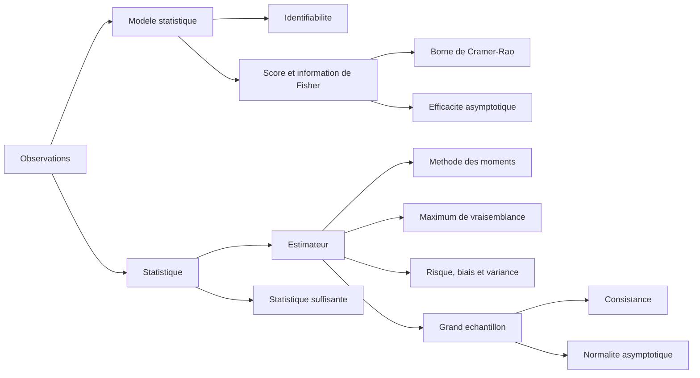

# Statistiques - modèles, estimation et précision

> [!abstract] Fil conducteur
> La statistique part d'un échantillon aléatoire $Z=(X_1,\ldots,X_n)$ et cherche à apprendre une quantité inconnue : un paramètre, une distribution, une probabilité, ou une règle de prédiction. Le cours répond à quatre questions : **que suppose-t-on sur les données ?**, **comment construire un estimateur ?**, **comment comparer sa précision ?**, puis **que devient-il lorsque $n$ grandit ?**

Cette note réorganise le support manuscrit autour des intuitions et d'un exemple fil rouge. Les formules servent à savoir quoi calculer et à interpréter le résultat, pas à remplacer l'idée derrière elles.

## La carte du cours

> [!tip] L'exemple fil rouge : des données oui/non
> Une campagne contient $n$ réponses indépendantes, codées $X_i=1$ pour « oui » et $X_i=0$ pour « non ». On suppose que chaque réponse vaut $1$ avec une probabilité inconnue $p$. Apprendre $p$ revient à apprendre la proportion réelle de « oui » dans la population. Cet exemple permettra de voir presque toutes les notions du cours sans les dissocier.

---

## 1. Du modèle aux données

### 1.1. Un modèle statistique est une famille d'explications possibles

Un modèle statistique contient une famille de lois de probabilité :

$$
\mathcal P=\{P_\theta : \theta\in\Theta\}.
$$

L'indice $\theta$ est le **paramètre inconnu**. Il représente ce qui varie d'une explication possible à l'autre. L'hypothèse centrale est qu'il existe une vraie valeur $\theta^\star$ telle que les observations ont été générées suivant $P_{\theta^\star}$.

La description complète fait intervenir un univers $\Omega$, une tribu $\mathcal F$, une variable aléatoire $Z$ et la famille de probabilités $P_\theta$. En pratique, on peut retenir l'image plus simple suivante : le modèle est une **boîte de lois candidates** ; les données doivent nous aider à choisir la bonne.

Très souvent,

$$
Z=(X_1,\ldots,X_n),
\qquad X_1,\ldots,X_n \text{ i.i.d. sous } P_\theta.
$$

« i.i.d. » signifie *indépendantes et de même loi*. C'est une hypothèse structurante : elle dit que chaque $X_i$ apporte une information nouvelle sur le même phénomène.

> [!warning] Un modèle n'est pas la réalité
> Dire que les $X_i$ sont i.i.d. est une hypothèse utile, pas une vérité automatique. Deux réponses d'une même personne, des mesures prises au fil du temps ou des observations voisines dans une image peuvent être dépendantes. Les estimateurs restent parfois utilisables, mais leurs garanties doivent alors être revues.

### 1.2. Paramétrique ou non paramétrique

Un modèle est **paramétrique** si $\Theta\subseteq\mathbb R^q$ pour un entier fini $q$. On résume alors l'inconnu par un nombre fini de coordonnées.

Exemples classiques :

- loi uniforme sur $[a,b]$, avec $\theta=(a,b)$ et $a<b$ ;
- loi gaussienne $\mathcal N(\mu,\sigma^2)$, avec $\theta=(\mu,\sigma^2)$ et $\sigma^2>0$ ;
- modèle de Bernoulli, avec $\theta=p\in[0,1]$.

Le modèle de Bernoulli de l'exemple fil rouge s'écrit

$$
P_p(X_i=1)=p,
\qquad P_p(X_i=0)=1-p.
$$

Dans un modèle **non paramétrique**, on ne force pas la loi à appartenir à une petite famille indexée par quelques nombres. Par exemple, on peut chercher directement une distribution $F$ ou une densité $f$, sans supposer a priori qu'elle est gaussienne. C'est plus souple, mais il faut plus de données pour apprendre un objet plus riche.

### 1.3. Identifiabilité : le paramètre doit avoir un sens observable

Le modèle est **identifiable** lorsque deux paramètres distincts donnent deux lois distinctes :

$$
P_\theta=P_{\theta'}
\quad\Longrightarrow\quad
\theta=\theta'.
$$

Sans cette propriété, même une infinité de données ne permettrait pas de distinguer certains paramètres : vouloir les estimer séparément n'aurait pas de sens.

> [!example] Un paramètre redondant
> Supposons que l'on paramètre une loi par $\theta\in\mathbb R$ mais que la loi ne dépende en réalité que de $\theta^2$. Les valeurs $\theta$ et $-\theta$ produisent exactement la même distribution. Le signe n'est donc pas identifiable ; on ne peut espérer apprendre que $|\theta|$ ou $\theta^2$.

### 1.4. Statistique, estimateur et décision

Une **statistique** est une quantité obtenue en appliquant une recette aux données $Z$. Formellement, c'est une fonction $T(Z)$. La recette ne doit pas demander de connaître la valeur inconnue de $\theta$ : elle doit pouvoir être exécutée dès que l'échantillon est observé.

Cela ne signifie pas que la statistique est un nombre fixe. **Avant** l'observation, $T(Z)$ est aléatoire car les données $Z$ le sont ; **après** l'observation, elle devient un nombre calculable. En revanche, $\theta$ lui-même n'est pas une statistique : c'est justement la quantité inaccessible que l'on cherche à apprendre.

La moyenne empirique est l'exemple fondamental :

$$
\overline X=\frac{1}{n}\sum_{i=1}^n X_i.
$$

Pour les réponses oui/non, $\overline X$ est tout simplement la proportion observée de « oui ». Elle ne contient aucun $p$ inconnu dans sa formule, donc c'est bien une statistique. Comme elle est aussi utilisée pour approcher $p$, on l'appelle plus précisément un **estimateur** de $p$.

D'autres statistiques résument les données autrement : $\max_i X_i$ garde seulement la plus grande valeur observée, la médiane garde un centre robuste aux valeurs extrêmes, et le nombre $\sum_i\mathbf 1_{\{X_i\ge 10\}}$ compte les observations au moins égales à $10$. Toutes sont calculables à partir de l'échantillon seul ; elles ne cherchent pas toutes à estimer le même objet.

Le mot **décision** est plus général. Une règle de décision est une fonction

$$
\delta:\mathcal Z\longrightarrow\mathcal D,
\qquad z\longmapsto\delta(z),
$$

qui transforme les données observées en une action. $\mathcal D$ est l'**espace des décisions** : il précise la forme de réponse autorisée. Une fois l'échantillon concret $z$ reçu, la règle $\delta$ renvoie une action déterminée $\delta(z)$.

- **Estimation.** Si le but est d'estimer $\theta$, on prend généralement $\mathcal D=\Theta$. La décision est alors $\widehat\theta=\delta(Z)$. Dans l'exemple Bernoulli, choisir $\delta(Z)=\overline X$ revient à décider que la meilleure estimation de $p$ est la proportion observée.

- **Classification binaire.** Pour un individu dont on connaît les caractéristiques $x$, l'action possible est une étiquette : $0$ ou $1$. On a donc $\mathcal D=\{0,1\}$. Par exemple, décider « non frauduleux » ou « frauduleux », ou « absent » ou « présent ». Si l'on apprend d'abord une règle pour classer de futurs individus, l'action construite à partir des données est une fonction $\widehat g_Z:\mathcal X\to\{0,1\}$ ; elle renverra ensuite une décision $\widehat g_Z(x)$ pour chaque nouveau $x$.

- **Prédiction ou régression.** La réponse n'est plus une étiquette, mais une valeur numérique ou plus généralement une sortie $\widehat y$. Pour prédire le prix d'un logement à partir de ses caractéristiques, la règle apprise est une fonction $f:\mathcal X\to\mathcal Y$, et la décision sur un logement $x$ est $f(x)$. Lorsque l'on doit prédire une seule valeur immédiatement, l'espace de décisions peut être directement $\mathcal D=\mathcal Y$ ; lorsque l'on apprend un prédicteur réutilisable, il est naturel de voir l'action comme la fonction $f$ elle-même.

> [!intuition]
> Une statistique est un **résumé calculé** à partir de l'échantillon. Une décision est ce que l'on **fait** de l'information disponible. Un estimateur est le cas particulier où la décision consiste à annoncer une valeur pour un paramètre inconnu. La distinction compte car la même statistique peut servir à plusieurs décisions : la moyenne peut estimer une espérance, déclencher une alerte si elle dépasse un seuil, ou devenir une variable d'entrée d'un classifieur.

---

## 2. Mesurer ce qu'est une bonne décision

### 2.1. Perte et risque

La **fonction de perte** $L(\theta,d)$ mesure le prix payé lorsque la vraie valeur est $\theta$ et que l'on prend la décision $d$. Comme les données sont aléatoires, la décision $\delta(Z)$ l'est aussi. On la juge donc en moyenne, via le **risque** :

$$
R(\theta,\delta)
=\mathbb E_\theta\bigl[L(\theta,\delta(Z))\bigr].
$$

Le risque est la quantité théorique que l'on aimerait minimiser. Il est théorique parce qu'il dépend de $\theta^\star$, précisément inconnue.

Pour l'estimation, la perte quadratique est la plus courante :

$$
L(\theta,\widehat\theta)
=\|\widehat\theta-\theta\|_2^2.
$$

Elle pénalise fortement les grandes erreurs. En dimension $1$, c'est simplement le carré de l'écart entre estimation et vérité.

> [!example] Une erreur de proportion
> Si la vraie proportion est $p=0{,}70$ et que l'on prédit $\widehat p=0{,}60$, la perte quadratique vaut $(0{,}60-0{,}70)^2=0{,}01$. Une erreur deux fois plus grande, égale à $0{,}20$, coûte quatre fois plus : $0{,}04$.

### 2.2. Lien avec l'apprentissage statistique

En prédiction, on observe des couples $(X,Y)$ et l'on cherche une fonction $f$ telle que $f(X)$ prédise bien $Y$. Son risque est

$$
\mathcal R(f)=\mathbb E\bigl[\ell(f(X),Y)\bigr].
$$

Avec la perte quadratique,

$$
\ell(f(X),Y)=\|f(X)-Y\|^2,
$$

la meilleure prédiction théorique est

$$
f^\star(x)=\mathbb E[Y\mid X=x].
$$

Cette formule ne dit pas que l'on connaît cette espérance conditionnelle : elle donne la cible idéale. L'apprentissage essaie de l'approcher avec les exemples disponibles.

Comme le vrai risque est inconnu, on calcule le **risque empirique** sur l'échantillon d'entraînement :

$$
\widehat{\mathcal R}_n(f)
=\frac{1}{n}\sum_{i=1}^n \ell\bigl(f(X_i),Y_i\bigr).
$$

> [!intuition]
> Le risque est la performance moyenne dans la population. Le risque empirique est la performance sur le petit échantillon que l'on a vu. Les confondre revient à croire qu'un élève qui a mémorisé ses exercices sait forcément résoudre un nouvel exercice.

---

## 3. Estimer sans imposer une famille de lois

Cette première famille de méthodes décrit directement ce que raconte l'échantillon. Elle sert en particulier lorsque l'on ne veut pas commencer par supposer une loi gaussienne, exponentielle ou autre.

### 3.1. Distribution empirique : chaque observation reçoit le même poids

La **distribution empirique** est

$$
\widehat P_n=\frac{1}{n}\sum_{i=1}^n\delta_{X_i},
$$

où $\delta_x$ désigne une masse de probabilité concentrée au point $x$. Pour tout ensemble $A$,

$$
\widehat P_n(A)
=\frac{1}{n}\sum_{i=1}^n\mathbf 1_{\{X_i\in A\}}.
$$

Autrement dit, elle donne à $A$ la fraction des observations qui sont tombées dans $A$.

Pour les données oui/non, $\widehat P_n(\{1\})=\overline X$. La proportion empirique est donc déjà une estimation non paramétrique de la probabilité d'un « oui ».

### 3.2. Moments empiriques

Le moment empirique d'ordre $k$ est la moyenne des puissances observées :

$$
\frac{1}{n}\sum_{i=1}^n X_i^k.
$$

Pour $k=1$, on retrouve la moyenne empirique. Pour $k=2$, on mesure une taille quadratique moyenne. Ces quantités imitent les moments théoriques $\mathbb E[X^k]$.

**Exemple — moyenne et dispersion.** Pour les données $2,3,3,4,8$, la moyenne vaut $4$. Elle résume le centre, mais cache la valeur isolée $8$. La variance empirique

$$
\frac{1}{n}\sum_{i=1}^n(X_i-\overline X)^2
$$

regarde au contraire la dispersion autour de ce centre.

### 3.3. Fonction de répartition empirique et histogramme

Quand les observations sont réelles, la **fonction de répartition empirique** est

$$
\widehat F_n(x)
=\frac{1}{n}\sum_{i=1}^n\mathbf 1_{\{X_i\le x\}}.
$$

Elle répond à la question : « quelle fraction des observations ne dépasse pas $x$ ? » C'est une fonction en escalier, qui monte de $1/n$ à chaque observation.

Le théorème de **Glivenko-Cantelli** affirme que, sous l'hypothèse i.i.d., cette courbe converge uniformément vers la vraie fonction de répartition $F$ :

$$
\sup_x\bigl|\widehat F_n(x)-F(x)\bigr|
\xrightarrow[n\to\infty]{\mathrm{p.s.}}0.
$$

Le message est fort : avec beaucoup de données indépendantes, l'escalier empirique est proche de la vraie courbe **partout à la fois**, pas seulement en un seuil $x$ fixé.

Un **histogramme** regroupe les valeurs dans des intervalles $[a_{j-1},a_j[$. Sa hauteur sur une classe est proportionnelle au nombre de données dans cette classe, divisé par la largeur de la classe :

$$
\widehat f_n(x)
=\sum_j
\frac{\widehat P_n([a_{j-1},a_j[)}{a_j-a_{j-1}}
\mathbf 1_{[a_{j-1},a_j[}(x).
$$

> [!tip] Lire un histogramme correctement
> Quand les classes n'ont pas la même largeur, il faut comparer les **aires** des rectangles, pas leurs hauteurs. Une barre haute et étroite peut représenter moins d'observations qu'une barre plus basse mais beaucoup plus large.

Le théorème de Donsker décrit plus finement les fluctuations : à l'échelle $\sqrt n$, l'écart $\widehat F_n-F$ converge vers un processus gaussien. Pour ce cours, il faut surtout retenir l'échelle : les fluctuations usuelles sont de l'ordre de $1/\sqrt n$.

---

## 4. Estimation paramétrique : deux recettes majeures

On suppose maintenant que les données suivent une loi $P_\theta$ d'une famille paramétrique. Le problème devient : comment choisir $\widehat\theta$ à partir de $X_1,\ldots,X_n$ ?

### 4.1. Méthode des moments : faire coïncider théorie et données

La méthode des moments remplace les moments théoriques par leurs versions empiriques. Si

$$
m_k(\theta)=\mathbb E_\theta[X^k],
$$

on choisit $\widehat\theta$ pour satisfaire, autant que possible,

$$
\frac{1}{n}\sum_{i=1}^n X_i^k
=m_k(\widehat\theta).
$$

Il faut en général autant d'équations que de paramètres inconnus.

#### Exemple détaillé : une gaussienne de moyenne et variance inconnues

Supposons que $X_i\sim\mathcal N(\mu,\sigma^2)$. Le paramètre $\mu$ décrit le centre de la distribution, tandis que $\sigma^2$ décrit sa dispersion autour de ce centre. Pour appliquer la méthode des moments, il faut d'abord savoir quels moments ces paramètres déterminent.

Une gaussienne peut s'écrire à partir d'une gaussienne centrée réduite $G\sim\mathcal N(0,1)$ :

$$
X=\mu+\sigma G.
$$

Comme $\mathbb E[G]=0$, la linéarité de l'espérance donne immédiatement

$$
\mathbb E[X]
=\mathbb E[\mu+\sigma G]
=\mu+\sigma\mathbb E[G]
=\mu.
$$

Pour le second moment, on utilise l'identité générale

$$
\operatorname{Var}(X)
=\mathbb E[X^2]-\mathbb E[X]^2.
$$

Ici, $\operatorname{Var}(X)=\sigma^2$ et $\mathbb E[X]=\mu$. Donc

$$
\sigma^2=\mathbb E[X^2]-\mu^2,
$$

soit

$$
\mathbb E[X^2]=\mu^2+\sigma^2.
$$

On peut maintenant faire correspondre les moments théoriques, inconnus, à leurs versions observables sur l'échantillon :

$$
\underbrace{\mathbb E[X]}_{\mu}
\quad\leadsto\quad
\underbrace{\frac1n\sum_{i=1}^nX_i}_{\overline X},
$$

$$
\underbrace{\mathbb E[X^2]}_{\mu^2+\sigma^2}
\quad\leadsto\quad
\underbrace{\frac1n\sum_{i=1}^nX_i^2}_{\text{second moment empirique}}.
$$

La méthode des moments impose donc deux équations pour les deux inconnues $\widehat\mu$ et $\widehat\sigma^2$ :

$$
\overline X=\widehat\mu,
$$

$$
\frac1n\sum_{i=1}^nX_i^2
=\widehat\mu^2+\widehat\sigma^2.
$$

La première donne directement

$$
\widehat\mu=\overline X.
$$

En remplaçant cette valeur dans la seconde, on obtient d'abord

$$
\widehat\sigma^2
=\frac1n\sum_{i=1}^nX_i^2-\overline X^2.
$$

Cette formule est exactement la variance empirique centrée. En effet,

$$
\begin{aligned}
\frac1n\sum_{i=1}^n(X_i-\overline X)^2
&=\frac1n\sum_{i=1}^n\left(X_i^2-2X_i\overline X+\overline X^2\right)\\
&=\frac1n\sum_{i=1}^nX_i^2
-2\overline X\left(\frac1n\sum_{i=1}^nX_i\right)
+\overline X^2\\
&=\frac1n\sum_{i=1}^nX_i^2-\overline X^2.
\end{aligned}
$$

Ainsi,

$$
\widehat\sigma^2
=\frac1n\sum_{i=1}^n(X_i-\overline X)^2.
$$

On centre autour de $\overline X$ parce que le vrai centre $\mu$ est inconnu : les données fournissent elles-mêmes le centre autour duquel on mesure leur dispersion.

**Pourquoi voit-on parfois $n-1$ au dénominateur ?** L'estimateur ci-dessus utilise $n$ ; c'est celui de la méthode des moments et aussi l'EMV dans le modèle gaussien. Il est légèrement biaisé vers le bas pour estimer $\sigma^2$, car $\overline X$ a été estimée sur le même échantillon. La version corrigée sans biais est

$$
\frac{1}{n-1}\sum_{i=1}^n(X_i-\overline X)^2.
$$

Les deux deviennent très proches lorsque $n$ est grand.

**Vérification numérique.** Avec les observations $2$, $4$ et $6$, on a $\overline X=4$ et le second moment empirique vaut $\frac{56}{3}$. Ainsi

$$
\widehat\sigma^2
=\frac{56}{3}-4^2
=\frac{8}{3}.
$$

On retrouve ce résultat en calculant directement la moyenne des écarts au carré : $((2-4)^2+(4-4)^2+(6-4)^2)/3=8/3$.

La méthode des moments est souvent rapide et très intuitive. Elle n'utilise toutefois qu'une partie de l'information présente dans la forme complète de la distribution.

### 4.2. Vraisemblance : choisir le paramètre qui rend les données les plus plausibles

Lorsque $P_\theta$ possède une densité ou une masse $p_\theta$, la **vraisemblance** de l'échantillon observé $z=(x_1,\ldots,x_n)$ est la fonction

$$
L(z,\theta)=p_\theta(z).
$$

Pour des observations i.i.d., elle se factorise :

$$
L(z,\theta)=\prod_{i=1}^n p_\theta(x_i).
$$

Une fois $z$ observé, on ne considère pas ici une probabilité « sur $\theta$ ». On fixe les données et l'on regarde quels paramètres leur donnent une densité élevée. C'est le sens du mot *vraisemblance*.

L'**estimateur du maximum de vraisemblance** ou EMV/MLE est

$$
\widehat\theta_{\mathrm{MV}}
\in\operatorname*{arg\,max}_{\theta\in\Theta}L(z,\theta).
$$

On maximise presque toujours la log-vraisemblance, car le logarithme est croissant et transforme le produit en somme :

$$
\ell(z,\theta)
=\log L(z,\theta)
=\sum_{i=1}^n\log p_\theta(x_i).
$$

#### Exemple détaillé : retrouver la proportion empirique

Reprenons les données oui/non de l'exemple fil rouge. On suppose

$$
X_i\sim\mathrm{Bernoulli}(p),
$$

où $X_i=1$ signifie « oui » et $X_i=0$ signifie « non ». Après observation, l'échantillon est une suite concrète $z=(x_1,\ldots,x_n)$ et

$$
S=\sum_{i=1}^n x_i
$$

est le nombre de « oui » observés. Il y a donc $n-S$ « non ».

Pour une observation, on peut écrire les deux cas $x_i=0$ et $x_i=1$ dans une seule formule :

$$
\mathbb P_p(X_i=x_i)
=p^{x_i}(1-p)^{1-x_i}.
$$

Grâce à l'indépendance des observations, la vraisemblance de toute la suite est le produit de ces contributions :

$$
L(z,p)
=\prod_{i=1}^n p^{x_i}(1-p)^{1-x_i}.
$$

En regroupant les facteurs, on obtient

$$
\begin{aligned}
L(z,p)
&=p^{\sum_{i=1}^n x_i}(1-p)^{\sum_{i=1}^n(1-x_i)}\\
&=p^S(1-p)^{n-S}.
\end{aligned}
$$

La vraisemblance ne dépend donc des données qu'à travers $S$. Pour estimer $p$, l'ordre des « oui » et des « non » n'apporte rien de plus que leur nombre total ; cette observation prépare la notion de statistique suffisante vue plus loin.

On maximise plus facilement la log-vraisemblance :

$$
\ell(z,p)
=\log L(z,p)
=S\log p+(n-S)\log(1-p).
$$

Pour $0<p<1$, sa dérivée vaut

$$
\ell'(z,p)
=\frac{S}{p}-\frac{n-S}{1-p}.
$$

Chercher un maximum à l'intérieur de l'intervalle revient à annuler cette dérivée :

$$
\frac{S}{p}-\frac{n-S}{1-p}=0.
$$

Après multiplication par $p(1-p)$, cela donne

$$
S(1-p)-p(n-S)=0,
$$

donc

$$
S-np=0.
$$

On trouve ainsi

$$
\widehat p_{\mathrm{MV}}
=\frac{S}{n}
=\frac1n\sum_{i=1}^nX_i
=\overline X.
$$

La dérivée seconde est

$$
\ell''(z,p)
=-\frac{S}{p^2}-\frac{n-S}{(1-p)^2}.
$$

Si $0<S<n$, elle est strictement négative : la log-vraisemblance est concave et ce point critique est bien son unique maximum. Dans les cas limites, toutes les réponses sont identiques : $S=0$ donne $\widehat p_{\mathrm{MV}}=0$, et $S=n$ donne $\widehat p_{\mathrm{MV}}=1$. La formule $S/n$ reste donc valable partout.

> [!example] Vérification numérique
> Si $7$ personnes sur $10$ répondent « oui », alors $S=7$ et
> $\widehat p_{\mathrm{MV}}=7/10=0{,}7$. Cette valeur ne signifie pas que la vraie probabilité vaut certainement $0{,}7$ ; elle signifie que, parmi les valeurs de $p$ du modèle Bernoulli, c'est celle qui rend l'échantillon observé le plus plausible.

Ce résultat rejoint exactement la méthode des moments de la section précédente : comme $\mathbb E_p[X]=p$, égaler ce moment à la moyenne empirique donne aussi $\widehat p=\overline X$. Dans ce modèle très simple, EMV et méthode des moments coïncident ; ce n'est pas automatique dans un modèle quelconque.

> [!warning] Maximum de vraisemblance ne signifie pas « modèle vrai »
> L'EMV choisit le meilleur paramètre **dans la famille proposée**. Si les données ne peuvent pas raisonnablement être décrites par une loi de cette famille, il peut être très précis pour estimer le mauvais objet.

---

## 5. Comparer les estimateurs : biais, variance et risque

On évalue un estimateur $T=T(Z)$ sous la vraie loi $P_{\theta^\star}$.

### 5.1. Biais : l'erreur systématique

Le biais de $T$ est

$$
b_\theta(T)=\mathbb E_\theta[T]-\theta.
$$

Un estimateur est **sans biais** lorsque $b_\theta(T)=0$ pour tout $\theta$. Si l'on répétait l'expérience un très grand nombre de fois, la moyenne de ses estimations tomberait alors sur la vérité.

#### Exemple détaillé : proportion empirique sans biais, puis estimateur biaisé

Dans le modèle Bernoulli déjà rencontré, on a $X_1,\ldots,X_n\sim\mathrm{Bernoulli}(p)$. La proportion empirique, qui était à la fois l'estimateur par moments et l'EMV, est

$$
\widehat p=\overline X
=\frac1n\sum_{i=1}^nX_i.
$$

Son biais vaut

$$
b_p(\widehat p)=\mathbb E_p[\widehat p]-p.
$$

Chaque $X_i$ a pour espérance $p$. Grâce à la linéarité de l'espérance,

$$
\begin{aligned}
\mathbb E_p[\widehat p]
&=\mathbb E_p\left[\frac1n\sum_{i=1}^nX_i\right]\\
&=\frac1n\sum_{i=1}^n\mathbb E_p[X_i]\\
&=\frac1n\sum_{i=1}^np\\
&=p.
\end{aligned}
$$

Ainsi,

$$
b_p(\widehat p)=0.
$$

La proportion empirique est donc **sans biais** : si l'on répétait l'expérience un très grand nombre de fois et que l'on moyennait toutes les estimations obtenues, cette moyenne tendrait vers la vraie proportion $p$.

> [!warning] Sans biais ne veut pas dire exact à chaque échantillon
> Si $p=0{,}7$ et que l'on n'observe que $10$ personnes, il est possible de voir seulement $5$ « oui », donc d'obtenir $\widehat p=0{,}5$. L'estimateur se trompe sur cet échantillon précis, mais il ne commet pas systématiquement une erreur dans la même direction.

Pour voir ce qu'est un biais, modifions légèrement l'estimateur :

$$
\widetilde p
=\frac{1}{n+1}\sum_{i=1}^nX_i.
$$

Il ressemble à $\overline X$, mais son dénominateur est $n+1$ au lieu de $n$. Son espérance est

$$
\mathbb E_p[\widetilde p]
=\frac{n}{n+1}p,
$$

et son biais vaut donc

$$
\begin{aligned}
b_p(\widetilde p)
&=\mathbb E_p[\widetilde p]-p\\
&=\frac{n}{n+1}p-p\\
&=-\frac{p}{n+1}.
\end{aligned}
$$

Pour tout $p>0$, ce biais est négatif : $\widetilde p$ sous-estime systématiquement $p$ en moyenne. Par exemple, pour $p=0{,}7$ et $n=9$,

$$
\mathbb E_p[\widetilde p]
=\frac9{10}\times0{,}7
=0{,}63.
$$

Même en répétant l'expérience, la moyenne de ces estimations tendrait vers $0{,}63$, et non vers $0{,}7$.

Le biais mesure donc un décalage **moyen** ; il ne dit pas à quel point les estimations varient d'un échantillon à l'autre. C'est précisément la question de la variance.

### 5.2. Variance : l'instabilité d'une répétition à l'autre

La variance (ou matrice de covariance en dimension vectorielle) mesure la fluctuation de l'estimateur autour de sa moyenne :

$$
\operatorname{Var}_\theta(T)
=\mathbb E_\theta\bigl[(T-\mathbb E_\theta[T])^2\bigr].
$$

Un estimateur peut être sans biais mais bruité : il tombe en moyenne au bon endroit, tout en changeant beaucoup d'un échantillon à l'autre.

Sous perte quadratique, le risque se décompose exactement en deux contributions :

$$
R(\theta,T)
=\operatorname{Var}_\theta(T)+b_\theta(T)^2.
$$

En dimension vectorielle, on remplace la variance par la trace de la matrice de covariance et le carré du biais par $\|b_\theta(T)\|^2$.

> [!intuition] Le compromis biais-variance
> Le biais est un décalage systématique : les flèches sont groupées mais à côté de la cible. La variance est une dispersion : les flèches sont éparpillées. La perte quadratique regarde les deux. Réduire l'un peut parfois augmenter l'autre ; comparer uniquement les biais ne suffit donc pas.

### 5.3. Domination et efficacité

Un estimateur $T$ **domine** un autre estimateur $T'$ s'il a un risque au plus aussi petit pour tout paramètre, et strictement plus petit pour au moins un paramètre. C'est une comparaison très forte : elle exclut tout compromis caché entre différentes valeurs possibles de $\theta$.

Si deux estimateurs ont le même biais, on dit que $T$ est plus **efficace** que $T'$ lorsqu'il a une variance plus faible pour tout $\theta$, strictement plus faible pour au moins un. À biais égal, une variance plus petite donne directement un risque quadratique plus petit.

#### Exemple détaillé : utiliser toute l'information disponible

Supposons maintenant que

$$
X_1,\ldots,X_n\sim\mathcal N(\mu,\sigma^2),
$$

et que l'on cherche à estimer la moyenne inconnue $\mu$. Comparons deux estimateurs :

$$
T_1=X_1,
$$

qui conserve seulement la première observation, et

$$
T_2=\overline X
=\frac1n\sum_{i=1}^nX_i,
$$

qui utilise toutes les observations.

Les deux estimateurs sont sans biais. En effet,

$$
\mathbb E_\mu[T_1]=\mathbb E_\mu[X_1]=\mu,
$$

et

$$
\begin{aligned}
\mathbb E_\mu[T_2]
&=\mathbb E_\mu\left[\frac1n\sum_{i=1}^nX_i\right]\\
&=\frac1n\sum_{i=1}^n\mathbb E_\mu[X_i]\\
&=\mu.
\end{aligned}
$$

Leur biais est donc identique, et nul. La différence apparaît dans leurs variances :

$$
\operatorname{Var}_\mu(T_1)=\sigma^2,
$$

tandis que l'indépendance des $X_i$ donne

$$
\begin{aligned}
\operatorname{Var}_\mu(T_2)
&=\operatorname{Var}_\mu\left(\frac1n\sum_{i=1}^nX_i\right)\\
&=\frac{1}{n^2}\sum_{i=1}^n\operatorname{Var}_\mu(X_i)\\
&=\frac{\sigma^2}{n}.
\end{aligned}
$$

Dès que $n>1$,

$$
\frac{\sigma^2}{n}<\sigma^2.
$$

La moyenne empirique $T_2$ est donc plus **efficace** que $T_1$ : à biais égal, elle fluctue moins, quelle que soit la valeur de $\mu$. Intuitivement, les erreurs positives et négatives de plusieurs observations indépendantes se compensent en partie. Utiliser $n$ observations réduit la variance par un facteur $n$ et l'amplitude typique des fluctuations par un facteur $\sqrt n$.

Sous perte quadratique, les deux estimateurs sans biais ont un risque égal à leur variance :

$$
R(\mu,T_1)=\sigma^2,
\qquad
R(\mu,T_2)=\frac{\sigma^2}{n}.
$$

Pour $n>1$, on a donc

$$
R(\mu,T_2)<R(\mu,T_1)
\qquad\text{pour toute valeur de }\mu.
$$

Ainsi, $\overline X$ **domine** $X_1$ sous perte quadratique : son risque n'est jamais plus grand et il est, ici, strictement plus petit pour tous les paramètres. L'exemple est volontairement simple — jeter $X_2,\ldots,X_n$ serait rarement raisonnable — mais il distingue bien les notions : l'efficacité compare les variances à biais égal ; la domination compare le risque total et peut donc aussi comparer des estimateurs dont les biais diffèrent.

---

## 6. Score, information de Fisher et limite de précision

Ces outils disent combien la distribution change lorsque l'on modifie légèrement le paramètre. Plus elle change vite, plus les données permettent en principe de localiser $\theta$.

### 6.1. Le score : la pente de la log-vraisemblance

Le **score** d'une observation $z$ est le gradient de la log-vraisemblance :

$$
S_\theta(z)
=\nabla_\theta\log p_\theta(z).
$$

Sous des hypothèses de régularité, son espérance est nulle :

$$
\mathbb E_\theta[S_\theta(Z)]=0.
$$

Cette identité exprime qu'au vrai paramètre, la log-vraisemblance n'a pas de pente moyenne dans une direction privilégiée.

#### Exemple détaillé : le score pour une moyenne gaussienne

Supposons qu'une observation suive une loi gaussienne

$$
X\sim\mathcal N(\mu,\sigma^2),
$$

où $\sigma^2$ est connue et $\mu$ est inconnue. Sa densité est

$$
p_\mu(x)
=\frac{1}{\sqrt{2\pi\sigma^2}}
\exp\left(-\frac{(x-\mu)^2}{2\sigma^2}\right).
$$

En prenant son logarithme, on obtient

$$
\log p_\mu(x)
=-\frac12\log(2\pi\sigma^2)
-\frac{(x-\mu)^2}{2\sigma^2}.
$$

Le premier terme ne dépend pas de $\mu$. En dérivant le second, on trouve

$$
\begin{aligned}
S_\mu(x)
&=\frac{\partial}{\partial\mu}\log p_\mu(x)\\
&=\frac{x-\mu}{\sigma^2}.
\end{aligned}
$$

Le score compare donc l'observation $x$ à la moyenne candidate $\mu$ :

- si $x>\mu$, le score est positif et augmenter légèrement $\mu$ rendrait $x$ plus plausible ;
- si $x<\mu$, le score est négatif et il pousse au contraire à diminuer $\mu$ ;
- si $x=\mu$, le score est nul.

La quantité $\sigma^2$ règle l'intensité de cette poussée. À écart $x-\mu$ identique, une observation peu dispersée, donc avec une petite variance, apporte une indication plus forte sur la position de $\mu$.

L'espérance du score est bien nulle sous le vrai paramètre :

$$
\begin{aligned}
\mathbb E_\mu[S_\mu(X)]
&=\mathbb E_\mu\left[\frac{X-\mu}{\sigma^2}\right]\\
&=\frac{\mathbb E_\mu[X]-\mu}{\sigma^2}\\
&=0.
\end{aligned}
$$

Si l'on répète l'expérience, certaines observations poussent la moyenne candidate vers le haut et d'autres vers le bas ; lorsque la valeur candidate est la bonne, ces poussées se compensent en moyenne.

Pour $n$ observations indépendantes, les log-vraisemblances, et donc les scores, s'additionnent :

$$
S_\mu(X_1,\ldots,X_n)
=\sum_{i=1}^n\frac{X_i-\mu}{\sigma^2}
=\frac{n}{\sigma^2}(\overline X-\mu).
$$

L'EMV cherche la valeur qui annule ce score total. On obtient alors

$$
\widehat\mu_{\mathrm{MV}}=\overline X.
$$

Cette lecture donne une intuition de la moyenne empirique : elle est la valeur de $\mu$ où les observations ne poussent plus, au total, la vraisemblance vers le haut ou vers le bas. La section suivante mesure précisément la variabilité de cette poussée à l'aide de l'information de Fisher.

### 6.2. Information de Fisher

L'**information de Fisher** est la variance du score :

$$
I(\theta)
=\operatorname{Var}_\theta\bigl(S_\theta(Z)\bigr)
=\mathbb E_\theta\bigl[S_\theta(Z)S_\theta(Z)^\top\bigr].
$$

Sous les mêmes hypothèses de régularité, elle s'écrit aussi comme l'opposé de la courbure moyenne de la log-vraisemblance :

$$
I(\theta)
=-\mathbb E_\theta\left[\nabla_\theta^2\log p_\theta(Z)\right].
$$

En une dimension, une grande information signifie que la log-vraisemblance forme un pic marqué autour du bon paramètre : de petits changements de $\theta$ deviennent visibles dans les données.

Pour deux blocs indépendants, les informations s'additionnent. En particulier, pour $n$ observations i.i.d.,

$$
I_{(X_1,\ldots,X_n)}(\theta)
=nI_{X_1}(\theta).
$$

#### Exemple détaillé : information de Fisher pour une proportion

Reprenons une observation $X\sim\mathrm{Bernoulli}(p)$, avec $0<p<1$. Sa masse de probabilité peut s'écrire sous une forme unique pour les deux issues :

$$
p_p(x)=p^x(1-p)^{1-x},
\qquad x\in\{0,1\}.
$$

Sa log-masse est donc

$$
\log p_p(x)
=x\log p+(1-x)\log(1-p).
$$

En dérivant par rapport à $p$, le score est

$$
\begin{aligned}
S_p(x)
&=\frac{\partial}{\partial p}\log p_p(x)\\
&=\frac{x}{p}-\frac{1-x}{1-p}\\
&=\frac{x-p}{p(1-p)}.
\end{aligned}
$$

Il prend deux valeurs :

$$
S_p(1)=\frac1p,
\qquad
S_p(0)=-\frac{1}{1-p}.
$$

Son espérance est nulle, comme attendu pour un score :

$$
\mathbb E_p[S_p(X)]
=\frac{\mathbb E_p[X]-p}{p(1-p)}
=0.
$$

L'information de Fisher est donc l'espérance de son carré. Comme $X$ vaut $1$ avec probabilité $p$ et $0$ avec probabilité $1-p$,

$$
\begin{aligned}
I_X(p)
&=p\left(\frac1p\right)^2
+(1-p)\left(-\frac{1}{1-p}\right)^2\\
&=\frac1p+\frac{1}{1-p}\\
&=\boxed{\frac{1}{p(1-p)}}.
\end{aligned}
$$

Le signe négatif du score associé à $X=0$ disparaît au carré. Les facteurs $p$ et $1-p$ sont les poids qui reflètent la fréquence respective des deux issues.

La formule est minimale au centre :

$$
I_X\left(\frac12\right)=4.
$$

Elle augmente lorsque $p$ se rapproche de $0$ ou de $1$. Pour comprendre ce point, prenons $p=0{,}1$ :

$$
I_X(0{,}1)
=\frac{1}{0{,}1\times0{,}9}
\approx11{,}1.
$$

Ce nombre n'est pas une probabilité : c'est la variance du score, donc une mesure de la sensibilité moyenne de la log-vraisemblance aux variations de $p$. Lorsque $p=0{,}1$, les scores possibles sont

$$
S_{0{,}1}(1)=10,
\qquad
S_{0{,}1}(0)\approx-1{,}11.
$$

Un « oui » est rare, mais il pousse très fortement à augmenter la valeur candidate de $p$ ; un « non » est attendu et produit une poussée faible vers le bas. L'information est la moyenne pondérée des carrés de ces poussées :

$$
0{,}1\times10^2+0{,}9\times(-1{,}11\ldots)^2
\approx10+1{,}1
\approx11{,}1.
$$

De manière symétrique, si $p$ est proche de $1$, l'observation rare $X=0$ pousse fortement à diminuer $p$. La formule est étudiée pour $0<p<1$ : elle diverge près des bords, où les hypothèses de régularité des théorèmes généraux demandent une attention particulière.

Pour $n$ réponses indépendantes, les informations s'additionnent et deviennent

$$
I_{(X_1,\ldots,X_n)}(p)
=\frac{n}{p(1-p)}.
$$

Ainsi, passer d'une observation à $n$ observations indépendantes multiplie l'information par $n$. La section suivante montrera que la variance atteignable est alors de l'ordre de $1/n$, tandis que l'erreur typique, qui est un écart-type, est de l'ordre de $1/\sqrt n$.

### 6.3. Borne de Cramér-Rao : une limite pour les estimateurs sans biais

La borne de **Cramér-Rao** affirme, sous des hypothèses de régularité, que tout estimateur sans biais $T$ de $g(\theta)$ vérifie

$$
\operatorname{Cov}_\theta(T)
\succeq
Dg(\theta)I(\theta)^{-1}Dg(\theta)^\top.
$$

Ici, $g$ désigne la quantité que l'on souhaite estimer à partir du paramètre. Par exemple, si l'objectif est d'estimer $\theta$ lui-même, on prend $g(\theta)=\theta$ ; si l'objectif est d'estimer son carré, on prend $g(\theta)=\theta^2$. La matrice $Dg(\theta)$ est la jacobienne de cette transformation et $A\succeq B$ signifie que $A-B$ est positive semi-définie.

En dimension scalaire, la borne s'écrit plus simplement

$$
\operatorname{Var}_\theta(T)
\geq
\frac{[g'(\theta)]^2}{I(\theta)}.
$$

Le facteur $g'(\theta)$ mesure la sensibilité de la quantité visée aux variations de $\theta$. Pour estimer directement un paramètre scalaire $\theta$, on a $g(\theta)=\theta$ et $g'(\theta)=1$ ; la formule devient alors

$$
\operatorname{Var}_\theta(T)
\ge I(\theta)^{-1}.
$$

> [!example] Estimer $p$ ou $p^2$
> Dans le modèle Bernoulli ci-dessous, estimer directement $p$ correspond à $g(p)=p$, donc $g'(p)=1$. Si l'on cherchait plutôt à estimer $p^2$, la borne scalaire ferait intervenir $g'(p)=2p$ et deviendrait $\operatorname{Var}_p(T)\geq4p^2/I(p)$.

Avec un échantillon i.i.d., l'information est multipliée par $n$, donc la meilleure variance possible est typiquement de taille $1/n$.

#### Exemple détaillé : la proportion empirique atteint la borne

Supposons que

$$
X_1,\ldots,X_n\sim\mathrm{Bernoulli}(p),
\qquad 0<p<1,
$$

et que l'on souhaite estimer $p$ avec la proportion empirique

$$
\widehat p=\overline X
=\frac1n\sum_{i=1}^nX_i.
$$

La borne concerne les estimateurs sans biais. Cette condition est bien satisfaite ici :

$$
\begin{aligned}
\mathbb E_p[\overline X]
&=\mathbb E_p\left[\frac1n\sum_{i=1}^nX_i\right]\\
&=\frac1n\sum_{i=1}^n\mathbb E_p[X_i]\\
&=\frac1n\sum_{i=1}^np\\
&=p.
\end{aligned}
$$

On estime directement $p$, donc $g(p)=p$ et $g'(p)=1$. D'après la section précédente, l'information de l'échantillon vaut

$$
I_{(X_1,\ldots,X_n)}(p)
=\frac{n}{p(1-p)}.
$$

La borne de Cramér-Rao impose alors, pour tout estimateur sans biais $T$ de $p$,

$$
\operatorname{Var}_p(T)
\geq\frac{1}{I_{(X_1,\ldots,X_n)}(p)}
=\frac{p(1-p)}{n}.
$$

Cette inégalité ne concerne pas seulement $\overline X$ : elle affirme qu'aucun estimateur sans biais ne peut avoir une variance inférieure à $p(1-p)/n$ dans ce modèle régulier.

Calculons maintenant la variance de la proportion empirique. Puisque

$$
\operatorname{Var}_p(X_i)=p(1-p)
$$

et que les observations sont indépendantes,

$$
\begin{aligned}
\operatorname{Var}_p(\overline X)
&=\operatorname{Var}_p\left(\frac1n\sum_{i=1}^nX_i\right)\\
&=\frac{1}{n^2}\sum_{i=1}^n\operatorname{Var}_p(X_i)\\
&=\frac{1}{n^2}\times np(1-p)\\
&=\frac{p(1-p)}{n}.
\end{aligned}
$$

Sa variance est donc exactement égale à la borne :

$$
\operatorname{Var}_p(\overline X)
=\frac{1}{I_{(X_1,\ldots,X_n)}(p)}.
$$

La proportion empirique est ainsi **efficace** dans ce modèle, au sens exact à taille finie : parmi les estimateurs sans biais, aucun ne peut faire mieux en variance.

> [!intuition]
> La borne dit : « parmi les estimateurs qui visent juste en moyenne, on ne peut pas réduire indéfiniment le bruit ». La moyenne empirique utilise toute l'information des $n$ réponses indépendantes et atteint exactement cette limite.

Pour un ordre de grandeur, si $p=1/2$ et $n=100$,

$$
\operatorname{Var}_{1/2}(\overline X)
=\frac{(1/2)(1/2)}{100}
=\frac{1}{400},
$$

donc son écart-type vaut $0{,}05$. En répétant des échantillons de $100$ réponses, les proportions observées fluctuent typiquement autour de $0{,}5$ à l'échelle de quelques centièmes. Aux bords $p=0$ et $p=1$, les hypothèses de régularité de Cramér-Rao demandent un traitement à part.

---

## 7. Suffisance : ne garder que l'information utile

Une statistique $T(Z)$ est **suffisante** pour $\theta$ si, une fois $T(Z)$ connu, la distribution conditionnelle des données complètes ne dépend plus de $\theta$.

$$
\mathcal L_\theta\bigl(Z\mid T(Z)\bigr)
\text{ ne dépend pas de }\theta.
$$

L'idée est celle d'une compression sans perte d'information sur le paramètre. Les données complètes peuvent contenir du détail aléatoire ; une statistique suffisante garde exactement ce qui est pertinent pour apprendre $\theta$.

**Exemple — dans le modèle de Bernoulli.** Le nombre total de « oui »

$$
S=\sum_{i=1}^nX_i
$$

est suffisant pour $p$. Dès que l'on connaît $S$, l'ordre dans lequel les « oui » et les « non » sont apparus ne renseigne plus sur $p$. La moyenne $\overline X=S/n$ est donc elle aussi suffisante : elle contient la même information que $S$.

> [!tip] Suffisant ne veut pas dire minimal
> Les données complètes $Z$ sont toujours suffisantes de façon triviale : elles ne perdent rien. L'intérêt est de trouver une statistique beaucoup plus petite, facile à stocker ou à analyser, qui préserve toute l'information sur le paramètre.

---

## 8. Quand la taille de l'échantillon grandit

Les propriétés asymptotiques étudient une suite d'estimateurs $T_n$, chacun construit avec $n$ données. Elles ne promettent pas nécessairement une précision parfaite pour un $n$ donné ; elles décrivent la tendance lorsque l'échantillon devient grand.

### 8.1. Consistance : finir par viser juste

$T_n$ est **consistant** pour $\theta$ si

$$
T_n\xrightarrow[n\to\infty]{\mathbb P}\theta.
$$

Concrètement, pour tout seuil de tolérance fixé, la probabilité d'une erreur plus grande que ce seuil tend vers zéro lorsque $n$ augmente.

Pour les Bernoulli, la loi des grands nombres donne

$$
\overline X\xrightarrow[n\to\infty]{\mathbb P}p.
$$

La proportion empirique est donc consistante.

Un biais qui tend vers zéro signifie seulement que l'erreur **moyenne** disparaît. Cela ne suffit pas à lui seul : la dispersion doit aussi se réduire. La consistance est la propriété qui combine réellement ces deux exigences.

### 8.2. Normalité asymptotique : connaître l'échelle de l'erreur

Un estimateur est **asymptotiquement normal** si

$$
\sqrt n\,(T_n-\theta)
\xrightarrow[n\to\infty]{\mathcal L}
\mathcal N(0,\Sigma(\theta)).
$$

Cette formule contient deux messages : l'erreur $T_n-\theta$ est typiquement de taille $1/\sqrt n$, et après le bon zoom par $\sqrt n$, sa forme limite est gaussienne. L'exemple Bernoulli rend ces deux idées concrètes.

#### Exemple détaillé : normalité asymptotique de la proportion empirique

Pour $X_1,\ldots,X_n\sim\mathrm{Bernoulli}(p)$, on estime $p$ par

$$
\widehat p_n=\overline X
=\frac1n\sum_{i=1}^nX_i.
$$

Comme

$$
\mathbb E_p[\overline X]=p,
\qquad
\operatorname{Var}_p(\overline X)=\frac{p(1-p)}{n},
$$

l'écart $\overline X-p$ est centré et son écart-type est

$$
\operatorname{sd}_p(\overline X)
=\sqrt{\frac{p(1-p)}{n}}.
$$

L'erreur est donc naturellement de taille $1/\sqrt n$. Par exemple, pour $p=1/2$,

$$
\operatorname{sd}_{1/2}(\overline X)
=\frac{1}{2\sqrt n}.
$$

Avec $n=100$, cet écart-type vaut $0{,}05$ ; avec $n=10\,000$, il vaut $0{,}005$. Les fluctuations de $\overline X-p$ s'écrasent donc progressivement autour de $0$. Multiplier par $\sqrt n$ revient à effectuer le bon **zoom** sur elles :

$$
Y_n=\sqrt n(\overline X-p).
$$

En effet,

$$
\operatorname{Var}_p(Y_n)
=n\operatorname{Var}_p(\overline X)
=p(1-p).
$$

La dispersion de cette quantité zoomée ne dépend plus de $n$. Le choix de $\sqrt n$ n'est donc pas arbitraire : la variance de $\overline X-p$ est proportionnelle à $1/n$, et le facteur $\sqrt n$ multiplie cette variance par $n$, exactement ce qu'il faut pour obtenir une limite non dégénérée.

Le théorème central limite s'écrit sous sa forme standardisée

$$
\frac{\sqrt n(\overline X-p)}{\sqrt{p(1-p)}}
\xrightarrow[n\to\infty]{\mathcal L}
\mathcal N(0,1),
$$

ou, de façon équivalente,

$$
\sqrt n(\overline X-p)
\xrightarrow[n\to\infty]{\mathcal L}
\mathcal N\bigl(0,p(1-p)\bigr).
$$

Cette formule est aussi celle du TCL appliqué à la somme :

$$
\frac{\sum_{i=1}^n(X_i-p)}{\sqrt{np(1-p)}}
=\frac{\sqrt n(\overline X-p)}{\sqrt{p(1-p)}}.
$$

Elle ne dit pas que $\overline X$ est exactement gaussienne à taille finie : cette variable ne peut prendre que les valeurs $0,1/n,2/n,\ldots,1$. Elle dit que, pour $n$ grand, la distribution de ses petites fluctuations autour de $p$ est bien approchée par une cloche. On résume cela par

$$
\overline X
\approx
\mathcal N\left(p,\frac{p(1-p)}{n}\right).
$$

> [!warning] Quand l'approximation normale est-elle crédible ?
> Elle est surtout fiable si $n$ est assez grand et si $p$ n'est pas trop près de $0$ ou de $1$. En pratique, il faut que les nombres attendus de succès et d'échecs ne soient pas trop petits.

**Exemple numérique.** Si $p=0{,}3$ et $n=400$,

$$
\operatorname{sd}_{0{,}3}(\overline X)
=\sqrt{\frac{0{,}3\times0{,}7}{400}}
\approx0{,}0229.
$$

Dans des répétitions de l'expérience, des proportions comme $0{,}27$ ou $0{,}33$ sont donc plausibles ; $0{,}50$ est beaucoup plus éloignée, à presque neuf écarts-types du centre. Dans ce cas, la variable zoomée $20(\overline X-0{,}3)$ est approximativement gaussienne de variance $0{,}21$.

Cette approximation permet aussi de quantifier l'incertitude. Un intervalle de confiance gaussien approximatif pour $p$ est

$$
\widehat p_n
\pm1{,}96\sqrt{\frac{\widehat p_n(1-\widehat p_n)}{n}}.
$$

Il remplace le $p$ inconnu dans l'écart-type théorique par son estimateur $\widehat p_n$. La normalité asymptotique implique la consistance et permet ainsi de passer d'une estimation ponctuelle à une estimation accompagnée de son incertitude.

### 8.3. Efficacité asymptotique et rôle de l'EMV

La normalité asymptotique donne une forme à l'erreur, mais elle permet aussi de comparer les estimateurs. Si

$$
\sqrt n(T_n-\theta)
\xrightarrow[n\to\infty]{\mathcal L}
\mathcal N(0,\Sigma(\theta)),
$$

alors, pour $n$ grand, on peut lire cette relation comme

$$
\operatorname{Cov}_\theta(T_n)
\approx\frac{\Sigma(\theta)}{n}.
$$

En dimension scalaire, $\Sigma(\theta)$ est donc la constante qui mesure le bruit restant une fois retiré le facteur universel $1/n$. À taille d'échantillon égale, une plus petite valeur de $\Sigma(\theta)$ signifie un estimateur asymptotiquement plus précis. En dimension vectorielle, $\Sigma(\theta)$ est une matrice de covariance.

L'information de Fisher d'une observation, $I_{X_1}(\theta)$, fixe la meilleure constante que l'on peut espérer dans un modèle régulier : son inverse. Un estimateur asymptotiquement normal est **asymptotiquement efficace** lorsqu'il atteint cette limite,

$$
\Sigma(\theta)=I_{X_1}(\theta)^{-1}.
$$

Autrement dit, sa covariance est approximativement égale à

$$
\operatorname{Cov}_\theta(T_n)
\approx\frac{I_{X_1}(\theta)^{-1}}{n}.
$$

#### Exemple : la moyenne d'une gaussienne de variance connue

Considérons

$$
X_1,\ldots,X_n\sim\mathcal N(\mu,\sigma^2),
$$

où $\sigma^2$ est connue. La section 6.1 a montré que le score d'une observation est $(X-\mu)/\sigma^2$. Son information de Fisher vaut donc

$$
I_{X_1}(\mu)
=\operatorname{Var}_\mu\left(\frac{X-\mu}{\sigma^2}\right)
=\frac{1}{\sigma^2},
$$

et son inverse est $\sigma^2$. L'EMV de $\mu$ est la moyenne empirique,

$$
\widehat\mu_{\mathrm{MV}}=\overline X.
$$

Ici, on connaît même sa loi exacte :

$$
\overline X
\sim
\mathcal N\left(\mu,\frac{\sigma^2}{n}\right).
$$

Ainsi,

$$
\sqrt n(\overline X-\mu)
\sim\mathcal N(0,\sigma^2),
$$

de sorte que

$$
\Sigma(\mu)=\sigma^2=I_{X_1}(\mu)^{-1}.
$$

La moyenne empirique est donc asymptotiquement efficace. Dans cet exemple particulièrement favorable, elle atteint même la borne de Cramér-Rao pour chaque taille d'échantillon finie, pas seulement à la limite.

Pourquoi l'EMV est-il souvent efficace ? Sous les hypothèses de régularité usuelles, la log-vraisemblance ressemble localement à une parabole autour du vrai paramètre : son maximum donne l'EMV, sa pente est le score et sa courbure est reliée à l'information de Fisher. Cette géométrie conduit à

$$
\sqrt n(\widehat\theta_{\mathrm{MV}}-\theta)
\xrightarrow[n\to\infty]{\mathcal L}
\mathcal N\left(0,I_{X_1}(\theta)^{-1}\right).
$$

L'EMV est alors consistant, asymptotiquement normal et asymptotiquement efficace : il utilise l'information de l'échantillon aussi bien que possible au premier ordre en $1/n$.

> [!warning] Les garanties ont des hypothèses
> « L'EMV est efficace » n'est pas une règle sans conditions. Il faut notamment un modèle identifiable et régulier, des paramètres non situés à un bord problématique et une information de Fisher inversible. L'efficacité vaut aussi seulement à l'intérieur du modèle supposé : elle ne protège pas contre un mauvais choix de modèle.

---

## À retenir avant de faire des exercices

1. Commencer par écrire le modèle : quelle est la loi de $X_i$ et quel est le paramètre inconnu ?
2. Vérifier l'identifiabilité : deux paramètres différents peuvent-ils donner les mêmes observations ?
3. Choisir l'objectif : estimer un paramètre, prédire, classer, ou décrire une loi inconnue.
4. Pour un modèle paramétrique, essayer d'abord les **moments**, puis écrire la **vraisemblance** et sa log-vraisemblance.
5. Ne pas juger un estimateur seulement par son biais : regarder aussi sa variance ou son risque quadratique.
6. Pour les données i.i.d., garder en tête les deux échelles clés : information proportionnelle à $n$, erreur typique proportionnelle à $1/\sqrt n$.
7. Distinguer une propriété exacte à taille finie, comme « sans biais », d'une propriété asymptotique, comme « consistant » ou « asymptotiquement normal ».

> [!summary] La phrase qui relie tout le cours
> Les données sont un échantillon aléatoire ; le modèle explique comment il dépend d'un paramètre ; une statistique le résume ; l'estimateur transforme ce résumé en réponse ; le risque mesure sa qualité ; l'information de Fisher fixe une limite de précision ; et l'asymptotique explique pourquoi davantage de données rendent l'estimation plus fiable.
